# MonoGame-based Odyssey Engine (K1/K2) — Clean-Room One‑Shot Implementation Plan

> **Purpose**: This document serves as a comprehensive, self-contained specification for an AI agent to implement a faithful KOTOR 1/2 engine reimplementation using MonoGame and C#. All implementation details are derived from behavioral observation, documented specifications, and in-game testing—never from existing codebases.

## Constraints (must not break)

- **Clean-room**: implementation is derived from behavioral observation, specification documents, and in-game testing. No code copying or translation from other implementations.
- **Commercial/closed-source-friendly**: avoid GPL/LGPL/AGPL dependencies in the shipped runtime; prefer permissive (MIT/BSD/Apache) and vetted commercial-friendly third parties.
- **Use CSharpKOTOR** as the **source-of-truth** for KOTOR file formats, installation scanning, and game data parsing.
- **Do not ship game assets**. The runtime must load from a user-provided KOTOR/TSL installation.
- **Repo convention**: keep new C# code **C# 7.3 compatible** where feasible (no nullable reference types, no C#8+ syntax), even if targeting modern .NET.

## Goal (what “done” means)

A playable, faithful KOTOR1/KOTOR2 runtime built on **MonoGame**, with modular libraries reusable by tooling and future "Odyssey-family" games, delivering:

- **Area loading & rendering**: modules (.rim/.mod/.erf) → scene with correct materials, lightmaps, and visibility.
- **Walkmesh + movement**: correct collision/nav on BWM and door/trigger volumes.
- **Actors**: creatures, placeables, doors; correct animations; basic AI.
- **Dialogue**: DLG playback with VO and lip sync; script hooks.
- **NWScript**: NCS VM execution + engine function surface (nwscript) sufficient to run core gameplay.
- **Save/Load**: functional K1/K2 saves (at least core state; expand to full parity).
- **Mod compatibility**: override/module precedence consistent with KOTOR.

## Feature catalog and behavioral reference (clean-room process)

To ensure comprehensive coverage, we maintain a behavioral feature catalog derived from in-game observation and documented specifications:

- **Resource system patterns**: module archive precedence, save overlays, streaming strategies.
- **Rendering behaviors**: material properties, lightmap application, transparency ordering, shader variants.
- **Script execution**: NCS VM semantics, action queue patterns, event timing, engine call dispatch.
- **Scene assembly**: room hierarchy, doorhook placement, VIS culling, entity spawning from GIT.
- **Gameplay systems**: dialogue flow, combat resolution, AI behaviors, save/load state management.

Deliverable from this phase: a **Feature Matrix** (spreadsheet or internal doc outside repo) mapping: subsystem → behavior expectations → testable acceptance criteria. This matrix is derived from in-game observation and specification documents, not from code analysis.

## Primary specifications (authoritative docs to implement against)

For a faithful modern reimplementation, treat the following as the canonical written specs for behavior and data layouts (in addition to in-game observation):

- **Resource system + overall Aurora/KotOR context**: `vendor/PyKotor/wiki/Home.md`
- **NWScript bytecode + VM semantics**: `vendor/PyKotor/wiki/NCS-File-Format.md`
- **Walkmesh (WOK/PWK/DWK) geometry, adjacency, AABB acceleration**: `vendor/PyKotor/wiki/BWM-File-Format.md`
- **Area layout assembly (rooms/tracks/obstacles/doorhooks)**: `vendor/PyKotor/wiki/LYT-File-Format.md`

These docs are also useful to keep at hand for the runtime content pipeline:

- `vendor/PyKotor/wiki/MDL-MDX-File-Format.md` (models/animations/attachments)
- `vendor/PyKotor/wiki/TPC-File-Format.md` + `vendor/PyKotor/wiki/TXI-File-Format.md` (textures + material metadata)
- `vendor/PyKotor/wiki/VIS-File-Format.md` (room visibility)
- `vendor/PyKotor/wiki/TLK-File-Format.md`, `vendor/PyKotor/wiki/LIP-File-Format.md`, `vendor/PyKotor/wiki/LTR-File-Format.md` (dialogue/VO/lipsync)

## High-level architecture

### Layering (strict)

- **Data/Formats layer (existing)**: `src/CSharpKOTOR` remains responsible for reading:
  - Installation lookup + precedence (`Installation`, `InstallationResourceManager`, `Module`, `ModuleResource`)
  - Formats: GFF/ERF/RIM/TLK/2DA/MDL/MDX/TPC/TGA/BWM/LYT/VIS/LIP/LTR/NCS, etc.
- **Runtime domain layer (new)**: game-agnostic runtime concepts (entity, components, world state, time, events, save model).
- **MonoGame integration layer (new)**: mapping runtime entities → MonoGame rendering structures (rendering, audio, input, UI).
- **Game rules layer (new)**: K1/K2-specific rulesets and data-driven interpretation (2DA-driven stats, feats, combat, etc.).

### New project layout (proposal)

Create a new folder `src/OdysseyRuntime/` with these SDK-style projects:

- `src/OdysseyRuntime/Odyssey.Core/` — pure domain, no MonoGame dependency.
- `src/OdysseyRuntime/Odyssey.Content/` — asset conversion/caching pipeline; depends on `CSharpKOTOR`.
- `src/OdysseyRuntime/Odyssey.Scripting/` — NCS VM + NWScript host surface (engine-call interface).
- `src/OdysseyRuntime/Odyssey.Kotor/` — K1/K2 rule modules, data tables, gameplay systems.
- `src/OdysseyRuntime/Odyssey.MonoGame/` — MonoGame adapters: rendering, audio, input, UI.
- `src/OdysseyRuntime/Odyssey.Game/` — MonoGame executable/launcher (select install, module, start game).
- `src/OdysseyRuntime/Odyssey.Tests/` — deterministic tests (VM, resource precedence, serialization, etc.).

Optional but recommended tooling (kept separate from runtime):

- `src/OdysseyRuntime/Odyssey.Tooling/` — headless import/validation commands (CI-friendly).

### Data flow diagram (comprehensive)

```mermaid
flowchart TD
  subgraph Installation["Installation & Resource Layer"]
    userInstall[User Install Path] --> gameProbe[Game Probe<br/>Detect K1/K2/Steam/GOG]
    gameProbe --> installScan[CSharpKOTOR.Installation]
    installScan --> resDirector[Resource Director<br/>Precedence Manager]
    
    resDirector --> keyBif[KEY/BIF Provider<br/>Chitin.key → *.bif]
    resDirector --> erfRim[ERF/RIM Provider<br/>Module Archives]
    resDirector --> overrideDir[Override Provider<br/>Loose Files]
    resDirector --> saveOverlay[Save Overlay<br/>SAV Resources]
    resDirector --> texturePacks[Texture Pack Provider<br/>swpc_tex_*.erf]
    
    keyBif & erfRim & overrideDir & saveOverlay & texturePacks --> resProvider[IGameResourceProvider<br/>Unified Async VFS]
  end
  
  subgraph ModuleLoading["Module Loading Pipeline"]
    resProvider --> moduleLoad[Module Loader]
    moduleLoad --> ifoParser[IFO Parser<br/>Module Metadata]
    moduleLoad --> areParser[ARE Parser<br/>Area Properties]
    moduleLoad --> gitParser[GIT Parser<br/>Instance Spawning]
    moduleLoad --> lytParser[LYT Parser<br/>Room Layout]
    moduleLoad --> visParser[VIS Parser<br/>Room Visibility]
    moduleLoad --> pthParser[PTH Parser<br/>Path Points]
  end
  
  subgraph ContentPipeline["Content Pipeline (Background Threads)"]
    resProvider --> contentCache[Content Cache<br/>Hash-Keyed Storage]
    
    contentCache --> textureConv[Texture Converter]
    textureConv --> tpcDecode[TPC Decode<br/>DXT/Mipmap/Cube]
    textureConv --> tgaDecode[TGA Decode<br/>RGBA/Palette]
    textureConv --> txiMaterial[TXI Parser<br/>Material Flags]
    tpcDecode & tgaDecode & txiMaterial --> monoGameTexture[MonoGame.Texture2D]
    
    contentCache --> modelConv[Model Converter]
    modelConv --> mdlDecode[MDL Decode<br/>Nodes/Meshes]
    modelConv --> mdxDecode[MDX Decode<br/>Vertex Data]
    modelConv --> skinDecode[Skin/Skeleton<br/>Bone Hierarchy]
    modelConv --> animDecode[Animation Decode<br/>Keyframes]
    mdlDecode & mdxDecode & skinDecode & animDecode --> monoGameModel[MonoGame.Model]
    
    contentCache --> walkmeshConv[Walkmesh Converter]
    walkmeshConv --> bwmDecode[BWM Decode<br/>Triangles/Adjacency]
    walkmeshConv --> aabbBuild[AABB Tree Build<br/>Spatial Queries]
    walkmeshConv --> surfaceMat[Surface Materials<br/>Walkability]
    bwmDecode & aabbBuild & surfaceMat --> navMesh[Navigation Mesh]
    
    contentCache --> audioConv[Audio Converter]
    audioConv --> wavDecode[WAV Decode]
    audioConv --> mp3Decode[MP3 Decode<br/>Optional]
    wavDecode & mp3Decode --> monoGameSound[MonoGame.SoundEffect]
  end
  
  subgraph WorldConstruction["World Construction"]
    ifoParser & areParser --> areaBuilder[Area Builder]
    gitParser --> entityFactory[Entity Factory]
    lytParser --> roomBuilder[Room Builder]
    visParser --> visibilityMgr[Visibility Manager]
    pthParser --> pathNetwork[Path Network]
    
    areaBuilder --> runtimeArea[Runtime Area]
    roomBuilder --> roomEntities[Room Entities]
    entityFactory --> objectSpawner[Object Spawner]
    
    objectSpawner --> utcLoader[UTC → Creature]
    objectSpawner --> utpLoader[UTP → Placeable]
    objectSpawner --> utdLoader[UTD → Door]
    objectSpawner --> uttLoader[UTT → Trigger]
    objectSpawner --> utwLoader[UTW → Waypoint]
    objectSpawner --> utsLoader[UTS → Sound]
    objectSpawner --> uteLoader[UTE → Encounter]
    
    utcLoader & utpLoader & utdLoader & uttLoader & utwLoader & utsLoader & uteLoader --> entityRegistry[Entity Registry<br/>ID ↔ Entity Map]
    roomEntities --> entityRegistry
    runtimeArea --> runtimeWorld[Odyssey.Core.World]
    entityRegistry --> runtimeWorld
  end
  
  subgraph SceneGraph["Scene Graph & Rendering"]
    runtimeWorld --> sceneGraphMgr[Scene Graph Manager]
    sceneGraphMgr --> modelNodes[Model Scene Nodes]
    sceneGraphMgr --> walkmeshNodes[Walkmesh Scene Nodes]
    sceneGraphMgr --> triggerNodes[Trigger Scene Nodes]
    sceneGraphMgr --> lightNodes[Light Scene Nodes]
    sceneGraphMgr --> emitterNodes[Emitter Scene Nodes]
    sceneGraphMgr --> soundNodes[Sound Scene Nodes]
    
    monoGameTexture --> materialFactory[Material Factory]
    monoGameModel --> modelNodes
    navMesh --> walkmeshNodes
    
    materialFactory --> opaquePass[Opaque Pass]
    materialFactory --> alphaPass[Alpha Pass<br/>Transparency Sort]
    materialFactory --> additivePass[Additive Pass]
    materialFactory --> lightmapPass[Lightmap Pass]
    
    opaquePass & alphaPass & additivePass & lightmapPass --> renderQueue[Render Queue]
    visibilityMgr --> renderQueue
    renderQueue --> gpu[GPU Rendering]
  end
  
  subgraph Scripting["NCS Scripting System"]
    runtimeWorld --> scriptScheduler[Script Scheduler]
    scriptScheduler --> eventDispatch[Event Dispatcher<br/>OnSpawn/OnHeartbeat/etc]
    scriptScheduler --> delayWheel[Delay Wheel<br/>DelayCommand Queue]
    
    eventDispatch --> ncsLoader[NCS Loader]
    ncsLoader --> ncsVm[NCS Virtual Machine]
    
    ncsVm --> vmStack[VM Stack<br/>4-byte Aligned]
    ncsVm --> vmCallStack[Call Stack<br/>Return Addresses]
    ncsVm --> vmGlobals[Global Variables]
    ncsVm --> vmLocals[Local Variables]
    ncsVm --> instrDispatch[Instruction Dispatch<br/>Opcode → Handler]
    
    instrDispatch --> engineApi[Engine API<br/>ACTION Dispatch]
    engineApi --> k1Profile[K1 Profile<br/>~850 Functions]
    engineApi --> k2Profile[K2 Profile<br/>~950 Functions]
    
    engineApi --> actionQueue[Action Queue System]
    actionQueue --> moveAction[MoveToLocation]
    actionQueue --> attackAction[AttackObject]
    actionQueue --> useAction[UseObject]
    actionQueue --> speakAction[SpeakString]
    actionQueue --> animAction[PlayAnimation]
    actionQueue --> waitAction[Wait]
    actionQueue --> doAction[DoCommand]
    
    moveAction & attackAction & useAction & speakAction & animAction & waitAction & doAction --> runtimeWorld
  end
  
  subgraph GameSystems["Game Systems"]
    runtimeWorld --> partyController[Party Controller<br/>Leader Selection]
    partyController --> followerAI[Follower AI<br/>Formation/Following]
    
    runtimeWorld --> perceptionSys[Perception System<br/>Sight/Sound Ranges]
    perceptionSys --> factionSys[Faction System<br/>Hostility Check]
    factionSys --> combatSys[Combat System]
    
    combatSys --> combatRound[Combat Round<br/>~3 Second Cycles]
    combatRound --> attackCalc[Attack Calculator<br/>D20 Resolution]
    combatRound --> damageCalc[Damage Calculator<br/>Effects/Resistance]
    combatRound --> animTiming[Animation Timing<br/>Projectiles/Hits]
    attackCalc & damageCalc & animTiming --> effectSys[Effect System<br/>Buffs/Debuffs]
    
    runtimeWorld --> dialogueSys[Dialogue System]
    dialogueSys --> dlgTraverse[DLG Traversal]
    dialogueSys --> condEval[Conditional Eval<br/>Script Checks]
    dialogueSys --> tlkLookup[TLK Lookup<br/>Localization]
    dialogueSys --> voPlayback[VO Playback]
    dialogueSys --> lipSync[LIP Sync<br/>Facial Animation]
    
    runtimeWorld --> saveSys[Save System]
    saveSys --> stateSerialize[State Serializer<br/>Globals/Party/Inventory]
    saveSys --> moduleState[Module State<br/>Object Positions]
    stateSerialize & moduleState --> saveFiles[SAV Files]
  end
  
  subgraph InputUI["Input & UI"]
    inputSys[Input System] --> clickHandler[Click Handler<br/>Object Selection]
    inputSys --> moveInput[Movement Input<br/>Click-to-Move]
    inputSys --> cameraInput[Camera Input<br/>Chase/Free/Dialog]
    inputSys --> menuInput[Menu Input<br/>Pause/Inventory]
    
    clickHandler --> raycastWalkmesh[Raycast Walkmesh]
    raycastWalkmesh --> pathfinder[Pathfinder<br/>A* on Adjacency]
    
    clickHandler --> raycastEntities[Raycast Entities]
    raycastEntities --> selectionMgr[Selection Manager]
    
    cameraInput --> cameraModes[Camera Modes]
    cameraModes --> chaseCamera[Chase Camera]
    cameraModes --> freeCamera[Free Camera]
    cameraModes --> dialogCamera[Dialog Camera]
    
    runtimeWorld --> uiSys[UI System]
    uiSys --> dialogueUI[Dialogue UI<br/>Text/Replies]
    uiSys --> hudUI[HUD<br/>Health/Party]
    uiSys --> menuUI[Menus<br/>Pause/Options]
    uiSys --> loadingUI[Loading Screen]
  end
  
  subgraph Audio["Audio System"]
    strideAudioClip --> audioMixer[Audio Mixer]
    audioMixer --> voChannel[VO Channel]
    audioMixer --> sfxChannel[SFX Channel]
    audioMixer --> musicChannel[Music Channel]
    audioMixer --> ambientChannel[Ambient Channel]
    
    soundNodes --> spatialAudio[Spatial Audio<br/>3D Positioning]
    spatialAudio --> audioMixer
    
    voPlayback --> voChannel
    combatSys --> sfxChannel
    runtimeArea --> ambientChannel
  end
```



### Detailed subsystem interaction patterns

The engine operates on a **fixed-timestep game loop** with the following per-frame phases:

1. **Input Phase**: collect input events, update camera, handle click-to-move
2. **Script Phase**: process delay wheel, fire heartbeats, execute action queues (budget-limited)
3. **Simulation Phase**: update entity positions, perception checks, combat rounds
4. **Animation Phase**: advance skeletal animations, particle emitters, lip sync
5. **Scene Sync Phase**: sync runtime transforms → MonoGame rendering structures
6. **Render Phase**: cull by VIS groups, sort transparency, submit draw calls
7. **Audio Phase**: update spatial audio positions, trigger one-shots

## Core interface definitions (implement exactly as specified)

These interfaces define the contracts between subsystems. Implement them precisely.

### Resource system interfaces

```csharp
// Unified resource access - wraps all precedence logic
public interface IGameResourceProvider
{
    Task<Stream> OpenResourceAsync(ResourceIdentifier id, CancellationToken ct);
    Task<bool> ExistsAsync(ResourceIdentifier id, CancellationToken ct);
    Task<IReadOnlyList<LocationResult>> LocateAsync(ResourceIdentifier id, SearchLocation[] order, CancellationToken ct);
    IEnumerable<ResourceIdentifier> EnumerateResources(ResourceType type);
}

// Resource precedence chain element
public interface IResourceProvider
{
    int Priority { get; }
    bool TryOpen(ResourceIdentifier id, out Stream stream);
    bool Exists(ResourceIdentifier id);
}
```

### Entity system interfaces

```csharp
// Core entity container
public interface IWorld
{
    IEntity CreateEntity(EntityTemplate template, Vector3 position, float facing);
    void DestroyEntity(uint objectId);
    IEntity GetEntity(uint objectId);
    IEntity GetEntityByTag(string tag, int nth = 0);
    IEnumerable<IEntity> GetEntitiesInRadius(Vector3 center, float radius, ObjectType typeMask);
    IArea CurrentArea { get; }
    IModule CurrentModule { get; }
}

// Runtime entity with components
public interface IEntity
{
    uint ObjectId { get; }
    string Tag { get; set; }
    ObjectType ObjectType { get; }
    T GetComponent<T>() where T : IComponent;
    void AddComponent<T>(T component) where T : IComponent;
    bool HasComponent<T>() where T : IComponent;
}

// Component types (not exhaustive)
public interface ITransformComponent : IComponent { Vector3 Position { get; set; } float Facing { get; set; } }
public interface IRenderableComponent : IComponent { string ModelResRef { get; } bool Visible { get; set; } }
public interface IActionQueueComponent : IComponent { void Add(IAction action); void Clear(); IAction Current { get; } }
public interface IStatsComponent : IComponent { int CurrentHP { get; set; } int MaxHP { get; } int GetAbility(Ability ability); }
public interface IScriptHooksComponent : IComponent { ResRef GetScript(ScriptEvent evt); }
public interface IPerceptionComponent : IComponent { float SightRange { get; } float HearingRange { get; } }
public interface IFactionComponent : IComponent { int FactionId { get; set; } bool IsHostile(IEntity other); }
```

### Script VM interfaces

```csharp
// Script execution VM
public interface INcsVm
{
    int Execute(NCS script, IExecutionContext ctx);
    void Abort();
    bool IsRunning { get; }
}

// Execution context for a script run
public interface IExecutionContext
{
    IEntity Caller { get; }      // OBJECT_SELF
    IEntity Triggerer { get; }   // GetEnteringObject, etc.
    IWorld World { get; }
    IEngineApi EngineApi { get; }
    IScriptGlobals Globals { get; }
}

// Engine function dispatch
public interface IEngineApi
{
    Variable CallEngineFunction(int routineId, IReadOnlyList<Variable> args, IExecutionContext ctx);
}

// Persistent script state
public interface IScriptGlobals
{
    int GetGlobalInt(string name);
    void SetGlobalInt(string name, int value);
    bool GetGlobalBool(string name);
    void SetGlobalBool(string name, bool value);
    string GetGlobalString(string name);
    void SetGlobalString(string name, string value);
    // Local vars per object
    int GetLocalInt(IEntity entity, string name);
    void SetLocalInt(IEntity entity, string name, int value);
}
```

### Action system interfaces

```csharp
public interface IAction
{
    ActionType Type { get; }
    int GroupId { get; set; }
    ActionStatus Update(IEntity actor, float deltaTime);
    void Dispose();
}

public enum ActionStatus { InProgress, Complete, Failed }

public interface IActionQueue
{
    void Add(IAction action);
    void AddFront(IAction action);
    void Clear();
    void ClearByGroupId(int groupId);
    IAction Current { get; }
    void Process(float deltaTime);
}

// Delay command wheel
public interface IDelayScheduler
{
    void ScheduleDelay(float delaySeconds, IAction action, IEntity target);
    void Update(float deltaTime);
}
```

## Clean-room process (industry standard)

To keep a defensible clean-room posture:

- **Spec extraction**: one group reads reference engines and writes *behavioral specs* and *acceptance tests* in neutral language.
- **Implementation**: another group implements from spec + observed game behavior (via in-game observation/logging), not from reference code.
- **Evidence trail**:
  - For each subsystem, maintain a list of *sources consulted* (project + file path + high-level behavior summary) **without copying code**.
  - Track acceptance tests derived from the spec.

## MonoGame choice justification (vs Ogre/three.js/Stride)

- **MonoGame** is the best fit for a .NET-first, commercially-friendly, long-lived runtime:
  - .NET ecosystem alignment (tooling, profiling, packaging, CI)
  - Modern rendering pipeline, cross-platform (Windows, Linux, macOS, consoles)
  - Permissive MIT licensing
  - Mature and stable API
  - Large community and documentation
- Ogre/three.js/Stride are useful reference points for behavior (materials, scene import), but we use MonoGame as our core rendering framework.

## Subsystem plans (what to build, in dependency order)

### 0) Repository + build foundation

- Add the new `OdysseyRuntime` projects to `HoloPatcher.sln`.
- Enforce conventions:
  - C# language version pinned (7.3) in new projects.
  - Nullable reference types disabled.
  - Central package management (`Directory.Packages.props`) if the repo already uses it; otherwise keep per-project references consistent.
  - CI matrix for Windows first; later Linux/macOS.

**Acceptance**: blank MonoGame window launches; can select install path; validates K1/K2 installation via `CSharpKOTOR.Installation.DetermineGame`.

### 1) Installation + resource virtualization (runtime-safe)

Leverage `CSharpKOTOR.Installation.Installation` and `Module` to implement:

- **Virtual file system** abstraction: `IGameResourceProvider` wrapping CSharpKOTOR lookup semantics:
  - **pre-save**: override → currently loaded module archives (MOD/RIM/ERF) → chitin (KEY/BIF) → hardcoded defaults
  - **post-save**: override → currently loaded module archives → currently loaded save (SAV) → chitin → hardcoded defaults
- **Streaming**: async read APIs + caching; avoid loading large archives repeatedly.
- **Deterministic precedence tests**: verify location ordering and fallbacks.

Resource order note (Odyssey/Aurora behavior target, per `vendor/PyKotor/wiki/Home.md`):

- Once a save is loaded, it becomes a **resource overlay** (lookups may resolve to save-contained resources before chitin).
- Module archives must be treated as a **stack**: the "current module" plus any explicitly loaded capsules.
- This must remain compatible with mod expectations and KOTOR's resource resolution rules.

**Implementation patterns**:

- **Resource provider interface**: `IGameResourceProvider` with methods:
  - `Task<Stream> OpenResourceAsync(ResourceIdentifier, CancellationToken)` — async stream access
  - `Task<bool> ResourceExistsAsync(ResourceIdentifier, CancellationToken)` — existence check without opening
  - `Task<List<LocationResult>> LocateResourceAsync(ResourceIdentifier, SearchLocation[], CancellationToken)` — multi-location lookup
- **Archive caching**: keep recently accessed ERF/RIM/BIF handles open with LRU eviction; close on module unload.
- **Resource metadata cache**: maintain a lightweight index of (resref, restype) → (location, size, offset) for fast existence checks.
- **Save overlay integration**: when a save is active, inject a `SaveResourceProvider` into the precedence chain that queries save ERF contents before falling back to installation.

**Acceptance**: can enumerate modules, load `module.ifo`, `*.are`, `*.git`, `*.lyt`, `*.vis`, `*.pth`, `*.dlg` for a chosen module. Async reads complete without blocking the main thread. Resource existence checks are fast (< 1ms for cache hits).

### 2) Asset pipeline (KOTOR → MonoGame runtime assets)

Create `Odyssey.Content` responsible for converting on demand:

- **Textures**: `TPC/TGA → MonoGame.Texture2D` with correct:
  - alpha handling, normal maps (if any), mipmaps, sRGB/linear rules.
- **Models**: `MDL/MDX → MonoGame.Model`:
  - geometry, skinning, animations, attachment nodes.
- **Walkmesh**: `BWM → navigation + collision mesh`.
- **Caching**: content cache directory keyed by (game, module, resref, hash-of-source-bytes, converter-version).

**Implementation patterns**:

- **Content converter interface**: `IContentConverter<TInput, TOutput>` with:
  - `Task<TOutput> ConvertAsync(TInput input, ConversionContext ctx, CancellationToken ct)`
  - `bool CanConvert(ResourceIdentifier ident)`
- **Conversion context**: provides `IGameResourceProvider`, `ContentCache`, `GameProfile`, and metadata (module ID, game version).
- **Progressive loading**: for models, support loading geometry first, then textures, then animations (allows early rendering with placeholder materials).
- **Cache key generation**: deterministic hash of (game, resref, restype, source bytes, converter version, platform GPU vendor) ensures cache consistency.
- **Background conversion**: queue conversion tasks on a thread pool; main thread can request with timeout/fallback to placeholder.
- **Dependency tracking**: if a model references textures, cache the dependency graph to invalidate downstream assets when source changes.
- **Memory management**: cache entries have size limits; evict least-recently-used entries when memory pressure is high.

**Acceptance**: can render a static model + texture in MonoGame; cache hit rate measurable; no stutter for repeated loads. Background conversion doesn't block main thread. Cache invalidation works correctly on converter updates.

### 3) Rendering: area scene assembly (first playable slice)

Implement `Odyssey.MonoGame` scene assembly:

- Read module layout (`LYT`) and visibility (`VIS`) to:
  - instantiate room meshes
  - apply VIS culling groups

**Scene graph architecture**:

- **Room hierarchy**: each room becomes a MonoGame rendering entity with model rendering; rooms are organized in the scene hierarchy.
- **Doorhook placement**: LYT doorhooks create placeholder entities at specified transforms; actual door models attach when GIT spawns doors.
- **VIS culling groups**: maintain a `VisibilityGroup` component per room; `VIS` file defines which groups are visible from each room; update on room transitions.
- **Material assignment**: room meshes reference materials with lightmaps; material instances are shared across rooms using the same texture set.
- **LOD support**: (phase 2) implement distance-based LOD for large areas; phase 1 uses full detail.

LYT specifics to implement (see `vendor/PyKotor/wiki/LYT-File-Format.md`):

- LYT is ASCII text with deterministic framing: `beginlayout` … `donelayout`.
- Sections are count-based:
  - `roomcount N` then N lines: `<room_model> <x> <y> <z>`
  - optional `trackcount`, `obstaclecount` (swoop racing; mostly K2)
  - `doorhookcount N` then N lines: `<room_name> <door_name> <x> <y> <z> <qx> <qy> <qz> <qw> [optional floats]`
- **Doorhooks**:
  - define door placement transforms in the area layout (position + quaternion)
  - some implementations record extra floats; parser must accept and ignore/roundtrip them safely.
- **Naming**: room and hook targets are case-insensitive; normalize (lowercase) for caching and lookups.
- **Important distinction**:
  - LYT doorhooks define **door placement** in the area layout.
  - BWM hooks (USE1/USE2) define **interaction points** for doors/placeables (see BWM spec below).
- Material system:
  - reproduce Odyssey material behaviors: lightmaps, envmaps, additive/alpha blend, cutout, two-sided, etc.
  - unify shading into a small set of MonoGame effects/shaders.

**Acceptance**: load a module and walk camera around; rooms show correct lightmaps and transparency ordering.

### 4) Player controller + collision + camera

- Build character controller on top of walkmesh:
  - project movement onto walkmesh triangles
  - handle ledges, ramps, transitions
  - door/trigger volume intersections

Walkmesh implementation requirements (see `vendor/PyKotor/wiki/BWM-File-Format.md`):

- **BWM header**: `"BWM "` + `"V1.0"` signature validation.
- **Walkmesh types**:
  - type `1`: area walkmesh (WOK). Includes AABB tree + walkable adjacency + perimeter edges.
  - type `0`: placeable/door walkmesh (PWK/DWK). Primarily collision; also provides hook vectors.
- **Hook vectors**:
  - `relative_hook1/2` and `absolute_hook1/2` (USE1/USE2 style interaction points).
  - Do not confuse with LYT doorhooks.
- **Adjacency encoding** (WOK):
  - per walkable face, three adjacency entries, one per local edge.
  - neighbor encoding: `adjacency = neighborFaceIndex * 3 + neighborLocalEdgeIndex`, `-1` = no neighbor.
  - decode: `face = adjacency // 3`, `edge = adjacency % 3`.
- **Perimeter edges** (WOK):
  - edges are boundary edges where adjacency is `-1`; edges may include transition IDs.
  - perimeter markers indicate loop boundaries; treat the on-disk encoding carefully (docs note 1-based end markers).
- **AABB acceleration** (WOK):
  - support raycasts (mouse click → walkable triangle), point queries (find face under actor), and line-of-sight tests.
  - AABB nodes are fixed-size (44 bytes) in the file; child interpretation must be consistent with the spec.
- **Surface materials / walkability**:
  - implement walkability rules driven by surface material ids (from `surfacemat.2da` semantics).
  - collision vs walkability must differ: non-walkable faces still participate in collision.

Click-to-move depends on these primitives:

- raycast from camera into walkmesh using the AABB tree
- compute intersection point and clamp/project onto walkable triangle set
- pathfind over walkable adjacency graph (phase 2), but phase 1 can do "direct projected move" for minimal viability.
- Camera modes:
  - KOTOR-style chase camera + free camera for debugging.

**Pathfinding implementation** (A* over walkmesh adjacency):

```csharp
public class WalkmeshPathfinder
{
    private readonly NavigationMesh _navMesh;
    
    public List<Vector3> FindPath(Vector3 start, Vector3 goal)
    {
        int startFace = _navMesh.FindFaceAt(start);
        int goalFace = _navMesh.FindFaceAt(goal);
        
        if (startFace < 0 || goalFace < 0)
            return null;  // Not on walkable surface
        
        // A* over face adjacency graph
        var openSet = new PriorityQueue<int, float>();
        var cameFrom = new Dictionary<int, int>();
        var gScore = new Dictionary<int, float> { [startFace] = 0 };
        var fScore = new Dictionary<int, float> { [startFace] = Heuristic(startFace, goalFace) };
        
        openSet.Enqueue(startFace, fScore[startFace]);
        
        while (openSet.Count > 0)
        {
            int current = openSet.Dequeue();
            
            if (current == goalFace)
                return ReconstructPath(cameFrom, current, start, goal);
            
            foreach (int neighbor in _navMesh.GetAdjacentFaces(current))
            {
                if (neighbor < 0) continue;  // Edge of mesh
                if (!_navMesh.IsWalkable(neighbor)) continue;
                
                float tentativeG = gScore[current] + EdgeCost(current, neighbor);
                
                if (!gScore.ContainsKey(neighbor) || tentativeG < gScore[neighbor])
                {
                    cameFrom[neighbor] = current;
                    gScore[neighbor] = tentativeG;
                    fScore[neighbor] = tentativeG + Heuristic(neighbor, goalFace);
                    
                    if (!openSet.Contains(neighbor))
                        openSet.Enqueue(neighbor, fScore[neighbor]);
                }
            }
        }
        
        return null;  // No path found
    }
    
    private float Heuristic(int from, int to)
    {
        return Vector3.Distance(_navMesh.GetFaceCenter(from), _navMesh.GetFaceCenter(to));
    }
    
    private float EdgeCost(int from, int to)
    {
        // Base cost is distance, modified by surface material
        float dist = Vector3.Distance(_navMesh.GetFaceCenter(from), _navMesh.GetFaceCenter(to));
        float surfaceMod = _navMesh.GetSurfaceCost(to);  // e.g., 1.0 normal, 1.5 rough, 999 unwalkable
        return dist * surfaceMod;
    }
    
    private List<Vector3> ReconstructPath(Dictionary<int, int> cameFrom, int current, Vector3 start, Vector3 goal)
    {
        var path = new List<Vector3> { goal };
        while (cameFrom.ContainsKey(current))
        {
            current = cameFrom[current];
            path.Add(_navMesh.GetFaceCenter(current));
        }
        path.Add(start);
        path.Reverse();
        return SmoothPath(path);  // Optional: funnel algorithm for smooth paths
    }
}

public class NavigationMesh
{
    private readonly Vector3[] _vertices;
    private readonly int[] _indices;           // Triangle indices (3 per face)
    private readonly int[] _adjacency;          // 3 adjacency entries per face
    private readonly int[] _surfaceMaterials;   // Material per face
    private readonly AABBNode _aabbRoot;
    
    public int FindFaceAt(Vector3 point)
    {
        // Use AABB tree to narrow candidates, then test point-in-triangle
        return _aabbRoot.FindFaceContaining(point, _vertices, _indices);
    }
    
    public IEnumerable<int> GetAdjacentFaces(int faceIndex)
    {
        int baseIdx = faceIndex * 3;
        yield return DecodeAdjacency(_adjacency[baseIdx + 0]);
        yield return DecodeAdjacency(_adjacency[baseIdx + 1]);
        yield return DecodeAdjacency(_adjacency[baseIdx + 2]);
    }
    
    private int DecodeAdjacency(int encoded)
    {
        if (encoded < 0) return -1;  // No neighbor
        return encoded / 3;  // Face index (edge = encoded % 3)
    }
    
    public bool IsWalkable(int faceIndex)
    {
        int material = _surfaceMaterials[faceIndex];
        return _surfaceTable.IsWalkable(material);  // From surfacemat.2da
    }
}
```

**Camera controller**:

```csharp
public class CameraController
{
    public CameraMode Mode { get; set; } = CameraMode.Chase;
    
    // Chase camera parameters (KOTOR-style)
    public float Distance { get; set; } = 5.0f;
    public float Height { get; set; } = 2.0f;
    public float Pitch { get; set; } = 25.0f;  // Degrees down from horizontal
    public float Yaw { get; set; }              // Follows player facing by default
    public float LagFactor { get; set; } = 5.0f;
    
    private Vector3 _currentPosition;
    private Vector3 _targetPosition;
    
    public void Update(IEntity followTarget, float deltaTime)
    {
        switch (Mode)
        {
            case CameraMode.Chase:
                UpdateChaseCamera(followTarget, deltaTime);
                break;
            case CameraMode.Dialog:
                UpdateDialogCamera(deltaTime);
                break;
            case CameraMode.Free:
                UpdateFreeCamera(deltaTime);
                break;
        }
    }
    
    private void UpdateChaseCamera(IEntity target, float dt)
    {
        // Calculate ideal camera position behind player
        float yawRad = MathF.PI * Yaw / 180f;
        float pitchRad = MathF.PI * Pitch / 180f;
        
        Vector3 offset = new Vector3(
            -MathF.Sin(yawRad) * MathF.Cos(pitchRad) * Distance,
            MathF.Sin(pitchRad) * Distance + Height,
            -MathF.Cos(yawRad) * MathF.Cos(pitchRad) * Distance
        );
        
        _targetPosition = target.Position + offset;
        
        // Smooth follow
        _currentPosition = Vector3.Lerp(_currentPosition, _targetPosition, LagFactor * dt);
        
        // Collision with walls/ceiling (raycast from target to camera)
        if (World.Walkmesh.Raycast(target.Position + Vector3.UnitY * Height, _currentPosition, out Vector3 hit))
        {
            _currentPosition = hit - Vector3.Normalize(_currentPosition - target.Position) * 0.5f;
        }
        
        Camera.Position = _currentPosition;
        Camera.LookAt(target.Position + Vector3.UnitY * 1.5f);
    }
}

public enum CameraMode { Chase, Dialog, Free, Cinematic }
```

**Acceptance**: controllable PC can move within a module without falling through or walking through blocked walkmesh. Pathfinding produces smooth routes around obstacles. Camera follows player smoothly with collision avoidance.

### 5) Entity model: creatures/doors/placeables + basic interaction

- Runtime entity system in `Odyssey.Core`:
  - entity id, components (Transform, Renderable, Collider, Faction, Stats, Inventory)
  - event bus (OnEnterTrigger, OnUse, OnHeartbeat, etc.)
- KOTOR loaders:
  - `GIT` spawns (creatures/placeables/doors/triggers/waypoints)
  - templates `UTC/UTP/UTD/...`

**Implementation patterns**:

- **Entity registry**: maintain a bidirectional map `EntityId ↔ Entity` with fast lookup by ID, tag, and type.
- **Component storage**: use a sparse set or archetype-based storage for efficient iteration over component types (e.g., all `Transform` components, all `Renderable` components).
- **Entity lifecycle**:
  - Spawn: create entity → attach components from template → register in world → trigger `OnSpawn` script.
  - Update: per-frame component updates (transform sync, animation, AI) → event dispatch.
  - Despawn: trigger `OnDestroy` script → remove from registry → detach from scene graph → dispose components.
- **Template system**: `EntityTemplate` loads from GFF (UTC/UTP/UTD/etc.) and provides a factory method `Entity Spawn(World, Vector3, float)` that instantiates with default values.
- **Hierarchical entities**: support parent-child relationships for attachments (weapons on creatures, placeables on rooms).
- **Event routing**: entity-scoped events (OnUse, OnHeartbeat) route to the entity's script hooks; world-scoped events (OnModuleLoad) broadcast globally.

**Acceptance**: entities spawn from GIT and show in scene; click-to-select; interact with doors/placeables (even if stubbed). Entity registry lookups are O(1) by ID. Component iteration is efficient for rendering/AI updates.

### 6) Scripting: NCS

This is the single most schedule-critical subsystem. The engine can render without scripts, but it cannot be *KOTOR* without NWScript behavior.

#### 6.0 NCS format + VM invariants (must match)

Implement the bytecode format and core VM semantics as specified in `vendor/PyKotor/wiki/NCS-File-Format.md`:

- **Header (13 bytes)**:
  - signature `"NCS "` and version `"V1.0"`
  - byte at offset 8 must be `0x42` (program size marker, not an executable opcode)
  - uint32 file size at offset 9 is **big-endian**
  - instruction stream begins at offset `0x0D`.
- **Endian**:
  - all multi-byte integer/float arguments are **big-endian** (network order).
- **Instruction encoding**:
  - `<opcode:uint8><qualifier:uint8><args...>`
  - qualifier selects operand types (II/FF/SS/OO/VV/TT etc.).
- **Jump offsets**:
  - `JMP/JSR/JZ/JNZ` store a signed 32-bit **relative offset from the start of the jump instruction**, not from the next instruction.
- **Engine calls**:
  - `ACTION` arguments are: `uint16 routineId` + `uint8 argCount` (argCount counts **stack elements**, not bytes).
- **Deferred actions**:
  - `STORE_STATE` stores two signed int32 values (stack bytes to preserve, locals bytes to preserve); required for `DelayCommand`/action parameter semantics.
- **Stack model**:
  - stack is 4-byte aligned; vectors occupy 12 bytes (3 floats); structures are 4-byte multiples.
  - BP/SP conventions must support globals (`SAVEBP/RESTOREBP`, `CPTOPBP/CPDOWNBP`).
- **DESTRUCT semantics**:
  - complex stack cleanup that removes a range while preserving a subrange; this directly affects correct VM behavior for structure/vector access patterns.

#### 6.1 VM scope and interfaces

Build `Odyssey.Scripting` as a standalone, deterministic **stack-based VM** that executes `CSharpKOTOR.Formats.NCS.NCS`:

- **Core types**: int, float, string, object, vector, location, effect, event, talent, action (and any internal-only representations needed).
- **Execution model**:
  - Cooperative (script runs until it yields via action scheduling, delay, or completion).
  - Bounded step budget per frame to prevent lockups (deterministic, configurable).
- **Public API** (no MonoGame dependency):
  - `INcsVm`: load/execute script by resref; introspection; tracing.
  - `IScriptScheduler`: per-object script queues (OnSpawn, OnHeartbeat, OnUse, etc.).
  - `IEngineApi`: engine-call surface (ACTION instruction dispatch).
  - `IGameObjectResolver`: object-id ↔ runtime entity mapping, area scoping, module scoping.
  - `IScriptGlobals`: global vars, campaign DB, local vars per object, persistent storage (ties into Save/Load).

**VM implementation patterns**:

- **Script instance**: each running script is a `ScriptInstance` with its own stack, call stack, locals, and instruction pointer.
- **Execution context**: `ExecutionContext` holds the current script instance, object context (who owns the script), and engine API reference.
- **Instruction dispatch**: use a jump table or switch statement for opcodes; qualifier byte determines operand decoding (II/FF/SS/OO/VV/TT patterns).
- **Stack management**: maintain a 4-byte-aligned stack with bounds checking; vectors are 12 bytes (3 floats); structures are multiples of 4 bytes.
- **Call stack**: track return addresses and saved base pointers for function calls (`JSR`/`JMP`/`RSRSUB`).
- **Object reference handling**: object IDs are stored as integers; `IGameObjectResolver` maps to runtime entities; invalid IDs return `OBJECT_INVALID`.
- **String interning**: intern frequently used strings (empty string, common constants) to reduce allocations.
- **Deterministic RNG**: use a seeded RNG per script instance or per-object to ensure reproducible behavior.

> Note: `CSharpKOTOR` already has NCS representation + NWScript defs (`ScriptDefs`) and compiler pieces; the missing piece for runtime is an **execution VM** + **engine API**.

#### 6.2 Engine-call surface (ACTION)

Implement an `EngineApi` that supports K1/K2 via a `IGameProfile`:

- `K1Profile` and `K2Profile` provide:
  - function id mapping (routine id → name/signature),
  - behavior differences (where known),
  - data table bindings (2DA column names, default constants).

Implementation strategy:

- **Generate** a strongly-typed dispatch table at build time from `CSharpKOTOR.Common.Script.ScriptDefs`:
  - Output: `Odyssey.Scripting.Generated.NwscriptDispatch.K1.cs` and `...K2.cs`
  - Each contains: `switch (routineId)` → call into per-function handlers.
  - Handlers are partial methods to keep manual logic separate and clean-room-friendly.
- Build an **incremental coverage** approach:
  - Start with the minimum set required to boot modules and move the player (object/position, area, camera, actions, doors, triggers, conversations).
  - Expand using acceptance tests + game behavior observation.

#### 6.3 Action system (AssignCommand/DelayCommand)

Implement Odyssey-like action queues:

- Each creature has an **ActionQueue** with:
  - `AssignCommand(oSubject, action)` pushes action into subject queue.
  - `DelayCommand(t, action)` schedules action in a time wheel / priority queue.
  - `Action` parameters in NWScript compile into stored sub-states (`STORE_STATE`) + return later; mirror KOTOR semantics.
- Provide "heartbeats":
  - On heartbeat tick, process queued actions (bounded).
  - Standard script events: OnSpawn, OnHeartbeat, OnPerception, OnDamaged, OnDeath, OnConversation, OnUsed, OnEnter/Exit, etc.

**Action queue implementation**:

- **Action types**: `MoveToLocation`, `Attack`, `UseObject`, `SpeakString`, `PlayAnimation`, `Wait`, `ActionQueue` (nested), etc.
- **Queue structure**: FIFO queue per entity; current action executes until complete or interrupted; queued actions wait.
- **Action state**: each action has `Execute(Entity, float deltaTime) → ActionStatus` (Running/Complete/Interrupted).
- **Delay wheel**: use a time-ordered priority queue (min-heap) keyed by `(currentTime + delay)`; on each frame, pop actions whose time has arrived and push to entity queues.
- **STORE_STATE handling**: when an action parameter is compiled, the VM stores stack bytes and locals bytes; on action execution, restore the script state and continue from the stored instruction pointer.
- **Interruption**: combat, dialogue, or script-driven actions can interrupt the current action; interrupted actions are discarded (not resumed).
- **Heartbeat timing**: heartbeat events fire on a fixed interval (typically 6 seconds); each entity's heartbeat script runs independently.

#### 6.4 Script debugging & determinism

- Deterministic fixed-step time for script scheduler (independent of render FPS).
- Tracing:
  - instruction trace (optional),
  - engine-call trace (routine id/name, args, return),
  - per-entity script timeline.
- Script errors:
  - must include script name/resref + instruction index + call stack snapshot.
  - do not crash the runtime; isolate to script instance.

**Acceptance**:

- NCS reader validates `"NCS V1.0"` header, `0x42` marker, and big-endian size field; rejects invalid files.
- Instruction decoder round-trips offsets and resolves jump targets correctly using “offset from instruction start” semantics.
- Can execute a trivial NCS script that calls `PrintString`, `Random`, `ExecuteScript`, and schedules a delayed action.
- Action parameter semantics (compiled via `STORE_STATE`) produce correct deferred behavior.
- A curated set of K1/K2 vanilla scripts (small whitelist) run without VM exceptions.

### 7) Dialogue + VO + lipsync + cinematic basics

Implement dialogue playback using existing formats:

- **DLG**: conversation graph traversal, conditional checks, script hooks.
- **TLK**: localized text lookup.
- **VO**: StreamVoice/StreamWaves voice playback, matching node IDs.
- **LIP**: lipsync curves applied to head/jaw bones (minimum viable: mouth open/close; then phoneme shapes).
- **Cinematics**:
  - simple conversation camera: focus speaker/listener, cut/shot transitions.
  - run node scripts: OnStart/OnEnd actions, node scripts.

**Dialogue system implementation**:

```csharp
public class DialogueSystem
{
    private DLGFile _currentDialogue;
    private DLGNode _currentNode;
    private IEntity _owner;       // NPC being talked to
    private IEntity _pc;          // Player character
    private List<DLGReply> _availableReplies;
    private float _nodeTimer;
    private bool _waitingForVO;
    
    public DialogueState State { get; private set; }
    
    public void StartConversation(IEntity owner, IEntity initiator, string dlgResRef)
    {
        _currentDialogue = ResourceLoader.LoadDLG(dlgResRef);
        _owner = owner;
        _pc = initiator;
        
        // Find first valid entry point
        foreach (var entryIndex in _currentDialogue.StartingList)
        {
            var entry = _currentDialogue.Entries[entryIndex];
            if (EvaluateCondition(entry.Active))
            {
                EnterNode(entry);
                return;
            }
        }
        
        // No valid entries - conversation fails to start
        EndConversation();
    }
    
    private void EnterNode(DLGEntry entry)
    {
        _currentNode = entry;
        State = DialogueState.Speaking;
        
        // Execute entry script
        if (!string.IsNullOrEmpty(entry.Script))
            ExecuteScript(entry.Script, _owner, _pc);
        
        // Get text from TLK
        string text = TLKManager.GetString(entry.Text);
        
        // Play voice-over if available
        string voResRef = entry.VO; // or derive from Sound field
        if (!string.IsNullOrEmpty(voResRef))
        {
            _waitingForVO = true;
            AudioSystem.PlayVO(voResRef, _owner, OnVOComplete);
            
            // Start lipsync
            if (TryLoadLIP(voResRef, out var lip))
                StartLipSync(_owner, lip);
        }
        
        // Notify UI
        OnDialogueText?.Invoke(_owner, text);
        
        // Set camera for speaker
        CameraController.SetDialogueFocus(_owner, _pc);
        
        // Gather available replies
        _availableReplies = new List<DLGReply>();
        foreach (var replyIndex in entry.RepliesList)
        {
            var reply = _currentDialogue.Replies[replyIndex];
            if (EvaluateCondition(reply.Active))
                _availableReplies.Add(reply);
        }
    }
    
    public void SelectReply(int index)
    {
        if (State != DialogueState.WaitingForReply || index >= _availableReplies.Count)
            return;
        
        var reply = _availableReplies[index];
        
        // Execute reply script
        if (!string.IsNullOrEmpty(reply.Script))
            ExecuteScript(reply.Script, _pc, _owner);
        
        // Find next entry
        foreach (var entryIndex in reply.EntriesList)
        {
            var entry = _currentDialogue.Entries[entryIndex];
            if (EvaluateCondition(entry.Active))
            {
                EnterNode(entry);
                return;
            }
        }
        
        // No more entries - conversation ends
        EndConversation();
    }
    
    private bool EvaluateCondition(string scriptResRef)
    {
        if (string.IsNullOrEmpty(scriptResRef))
            return true;
        
        var result = ScriptVM.Execute(scriptResRef, new ExecutionContext
        {
            Caller = _owner,
            Triggerer = _pc
        });
        
        return result != 0;  // Script returns TRUE (1) if condition passes
    }
    
    public void Update(float dt)
    {
        if (State == DialogueState.Speaking)
        {
            if (!_waitingForVO)
            {
                // Text-only node - wait brief time then show replies
                _nodeTimer -= dt;
                if (_nodeTimer <= 0)
                    TransitionToReplies();
            }
        }
    }
    
    private void TransitionToReplies()
    {
        if (_availableReplies.Count == 0)
        {
            EndConversation();
            return;
        }
        
        // Single "[Continue]" reply - auto-proceed (common pattern)
        if (_availableReplies.Count == 1 && IsAutoAdvance(_availableReplies[0]))
        {
            SelectReply(0);
            return;
        }
        
        State = DialogueState.WaitingForReply;
        OnRepliesAvailable?.Invoke(_availableReplies);
    }
}

public enum DialogueState
{
    Inactive,
    Speaking,      // NPC is talking (VO playing or text displayed)
    WaitingForReply,  // Player must choose
    Paused         // ActionPauseConversation called
}
```

**LIP sync implementation**:

```csharp
public class LipSyncController
{
    private LIPFile _lip;
    private float _time;
    private IEntity _speaker;
    private SkeletonComponent _skeleton;
    
    // KOTOR uses ~10 phoneme shapes
    private static readonly string[] PhonemeShapes = 
    {
        "jaw_open", "lip_pucker", "lip_wide", "lip_round",
        "tongue_up", "tongue_out", "brow_up", "brow_down",
        "blink", "smile"
    };
    
    public void Start(IEntity speaker, LIPFile lip)
    {
        _speaker = speaker;
        _lip = lip;
        _time = 0;
        _skeleton = speaker.GetComponent<SkeletonComponent>();
    }
    
    public void Update(float dt)
    {
        if (_lip == null) return;
        
        _time += dt;
        
        // Find current keyframe
        for (int i = 0; i < _lip.Keyframes.Count - 1; i++)
        {
            if (_time >= _lip.Keyframes[i].Time && _time < _lip.Keyframes[i + 1].Time)
            {
                // Interpolate between keyframes
                float t = (_time - _lip.Keyframes[i].Time) / 
                          (_lip.Keyframes[i + 1].Time - _lip.Keyframes[i].Time);
                
                byte shapeA = _lip.Keyframes[i].Shape;
                byte shapeB = _lip.Keyframes[i + 1].Shape;
                
                ApplyPhoneme(shapeA, 1 - t);
                ApplyPhoneme(shapeB, t);
                return;
            }
        }
    }
    
    private void ApplyPhoneme(byte shape, float weight)
    {
        // Map shape index to blend shape or bone rotation
        // Exact mapping depends on model rig
        if (shape < PhonemeShapes.Length)
        {
            string boneName = PhonemeShapes[shape];
            _skeleton.SetBlendShape(boneName, weight);
        }
    }
}
```

**Acceptance**:

- Start a DLG with an NPC in an area; choose a reply; branch correctly; end conversation.
- Correct TLK text displayed; VO plays when available; lipsync animates at least one facial channel.
- Conditional scripts correctly gate dialogue branches.
- Camera switches between speaker and listener appropriately.

### 8) UI (in-game) + Input + UX baseline

Use **MonoGame UI** (SpriteBatch/SpriteFont or Myra) for the in-game HUD and menus (avoid mixing UI frameworks inside the runtime).

Minimum UI for the first playable slice:

- Install picker / module chooser (temporary, dev-oriented).
- In-game:
  - dialog panel with replies,
  - pause menu,
  - loading screen / progress,
  - debug overlay (FPS, streaming, current module, selected entity).

Input mapping:

- KOTOR-like controls (mouse click-to-move; WASD optional for dev).
- Camera controls (chase + free camera).
- Rebindable inputs via config.

**Acceptance**:

- Start game with selected installation + module; open pause; open dialogue; select replies; show loading progress.

### 9) Audio (music/sfx/vo) + resource decoding

Implement audio routing and decoding with commercial-friendly dependencies:

- VO: play from StreamVoice/StreamWaves (WAV) and any in-archive VO resources if present.
- SFX: play from game resources (WAV) with positional audio.
- Music: StreamMusic playback with correct area-combat transitions (phase 2; stub in phase 1).

Technical:

- `Odyssey.Content.AudioDecoder` should support:
  - WAV at minimum (no external dependency needed),
  - optional MP3/OGG via a permissive library if required by assets (only if KOTOR actually uses it in target installations).
- `Odyssey.MonoGame.AudioBridge` maps to MonoGame SoundEffect objects, with:
  - distance attenuation,
  - basic reverb zones (future).

**Acceptance**:

- VO + one-shot SFX play reliably with correct spatialization; no audio hitching during streaming.

### 10) World simulation: objects, stats, AI, combat (vertical slice first)

Build in layers so the game becomes playable early.

#### 10.1 Entity/Component model (runtime)

Core components in `Odyssey.Core`:

- Transform (position/orientation), Hierarchy/AttachPoints
- Renderable (mesh/material refs), Animator
- Collider (walkmesh/capsule/trigger), NavAgent
- Faction/Perception
- Stats (attributes, HP, defenses, saves, skills)
- Inventory/Equipment
- Conversation (state)
- ScriptHooks (event resrefs)

**Object type hierarchy** (must implement all):

```
Object (abstract base)
├── Creature
│   ├── PC (player-controlled)
│   └── NPC (AI-controlled)
├── Door
├── Placeable
├── Trigger (invisible volume)
├── Waypoint (invisible marker)
├── Sound (ambient emitter)
├── Store (merchant)
├── Encounter (spawn point)
├── Item (world-dropped or inventory)
└── AreaOfEffect (spell zones)
```

**Situated object base** (shared by Door, Placeable):

- Static position + facing
- Optional walkmesh (PWK/DWK)
- Usable/locked state
- Appearance from 2DA
- Script hooks (OnUsed, OnOpen, OnClose, OnDeath, OnHeartbeat)

**Creature-specific components**:

- Action queue (FIFO with interruption)
- Combat round state
- Perception list (seen/heard objects)
- Equipped items (slots: head, body, hands, weapons, etc.)
- Class levels + feat list + force powers

#### 10.2 Data-driven rules (KOTOR 1/2)

`Odyssey.Kotor` interprets these 2DA tables (partial list):

| Table | Purpose |

|-------|---------|

| `appearance.2da` | Model resref, walk/run speed, body type |

| `heads.2da` | Head model by race/gender |

| `baseitems.2da` | Item categories, damage, properties |

| `feat.2da` | Feat definitions, prerequisites |

| `spells.2da` | Force powers, ranges, effects |

| `classes.2da` | Class progression, hit dice, saves |

| `skills.2da` | Skill definitions |

| `surfacemat.2da` | Surface walkability, footstep sounds |

| `portraits.2da` | Portrait images |

| `placeables.2da` | Placeable appearance |

| `genericdoors.2da` | Door models |

| `ambientmusic.2da` | Music tracks |

| `ambientsound.2da` | Ambient sounds |

**GFF template types**:

| Extension | Object Type | Key Fields |

|-----------|-------------|------------|

| UTC | Creature | Appearance_Type, Faction, HP, Attributes, Feats, Scripts |

| UTP | Placeable | Appearance, Useable, Locked, OnUsed |

| UTD | Door | GenericType, Locked, OnOpen, OnClose |

| UTT | Trigger | Geometry (polygon), OnEnter, OnExit |

| UTW | Waypoint | Tag, position only |

| UTS | Sound | Active, Looping, Positional, ResRef |

| UTE | Encounter | Creature list, spawn conditions |

| UTI | Item | BaseItem, Properties, Charges |

#### 10.3 Perception system

Perception drives AI awareness and script events:

```csharp
public class PerceptionSystem
{
    const float UpdateInterval = 0.5f; // seconds between perception checks
    
    void UpdatePerception(ICreature subject)
    {
        float sightRange = subject.GetPerceptionRange(PerceptionType.Sight);
        float hearRange = subject.GetPerceptionRange(PerceptionType.Hearing);
        
        foreach (var other in world.GetCreaturesInRadius(subject.Position, Math.Max(sightRange, hearRange)))
        {
            if (other == subject) continue;
            
            bool wasSeen = subject.PerceptionList.WasSeen(other);
            bool wasHeard = subject.PerceptionList.WasHeard(other);
            
            bool canSee = CanSee(subject, other, sightRange);
            bool canHear = CanHear(subject, other, hearRange);
            
            // Fire perception events
            if (canSee && !wasSeen)
                FireEvent(subject, ScriptEvent.OnPerception, other, PerceptionType.Seen);
            if (!canSee && wasSeen)
                FireEvent(subject, ScriptEvent.OnPerception, other, PerceptionType.NotSeen);
            if (canHear && !wasHeard)
                FireEvent(subject, ScriptEvent.OnPerception, other, PerceptionType.Heard);
            
            subject.PerceptionList.Update(other, canSee, canHear);
        }
    }
    
    bool CanSee(ICreature subject, ICreature target, float range)
    {
        float dist = Vector3.Distance(subject.Position, target.Position);
        if (dist > range) return false;
        if (!target.Visible) return false;
        // Line-of-sight check through walkmesh
        return !world.Walkmesh.TestLineOfSight(subject.Position + eyeHeight, target.Position + eyeHeight);
    }
}
```

#### 10.4 Combat system (detailed)

Combat follows a **round-based** model with approximately 3-second rounds:

**Combat round structure**:

```csharp
public class CombatRound
{
    public ICreature Attacker;
    public IEntity Target;
    public RoundState State;
    public float TimeInState;
    public Attack Attack1;  // Primary attack
    public Attack Attack2;  // Offhand or counterattack (if duel)
    public bool IsDuel;     // Both combatants are hostile creatures
}

public enum RoundState
{
    Starting,      // 0.0s - init animations
    FirstAttack,   // ~0.5s - primary attack
    SecondAttack,  // ~1.5s - offhand/counter (if duel)
    Cooldown,      // ~2.5s - return to ready
    Finished       // 3.0s - complete
}

public struct Attack
{
    public ICreature Attacker;
    public IEntity Target;
    public IAction SourceAction;
    public AttackResult Result;
    public int Damage;
    public DamageType DamageType;
    public bool IsCritical;
    public bool IsOffhand;
}

public enum AttackResult
{
    Invalid,
    Hit,
    CriticalHit,
    Miss,
    Parried,
    Deflected,
    AutomaticHit
}
```

**Attack resolution** (D20-based):

```csharp
AttackResult ResolveAttack(Attack attack, bool offhand)
{
    int roll = Random(1, 20);
    
    // Natural 20 = always hit (check for crit)
    if (roll == 20)
    {
        int critConfirm = Random(1, 20);
        int critAC = GetDefense(attack.Target);
        if (critConfirm + GetAttackBonus(attack.Attacker, offhand) >= critAC)
            return AttackResult.CriticalHit;
        return AttackResult.Hit;
    }
    
    // Natural 1 = always miss
    if (roll == 1)
        return AttackResult.Miss;
    
    int attackBonus = GetAttackBonus(attack.Attacker, offhand);
    int targetAC = GetDefense(attack.Target);
    
    if (roll + attackBonus >= targetAC)
        return AttackResult.Hit;
    
    return AttackResult.Miss;
}

int GetAttackBonus(ICreature attacker, bool offhand)
{
    int bonus = attacker.BaseAttackBonus;
    bonus += GetAbilityModifier(attacker, offhand ? Ability.Dexterity : GetAttackAbility(attacker));
    bonus += GetEquipmentBonus(attacker.GetEquippedWeapon(offhand));
    bonus += GetFeatBonuses(attacker);
    bonus += GetEffectBonuses(attacker, EffectType.AttackBonus);
    if (offhand) bonus -= GetTwoWeaponPenalty(attacker);
    return bonus;
}

int CalculateDamage(Attack attack, bool offhand)
{
    var weapon = attack.Attacker.GetEquippedWeapon(offhand);
    int baseDamage = RollDamage(weapon.DamageDice, weapon.DamageCount);
    int abilityMod = GetAbilityModifier(attack.Attacker, Ability.Strength);
    if (offhand) abilityMod /= 2;
    int total = baseDamage + abilityMod + weapon.DamageBonus;
    if (attack.Result == AttackResult.CriticalHit)
        total *= weapon.CritMultiplier;
    return Math.Max(1, total);
}
```

**Combat animations** (weapon-dependent):

- Melee: swing/thrust variants (1-3)
- Ranged: shoot/rapid fire
- Dual wield: alternate attacks
- Unarmed: punch/kick

#### 10.5 Effect system

Effects are temporary or permanent modifiers applied to entities:

```csharp
public abstract class GameEffect
{
    public EffectType Type { get; }
    public EffectDuration Duration { get; }
    public float RemainingTime { get; set; }
    public IEntity Creator { get; }
    public int SpellId { get; }
    
    public abstract void Apply(IEntity target);
    public abstract void Remove(IEntity target);
    public virtual void Update(IEntity target, float dt) { }
}

// ~60+ effect types to implement (core subset):
public enum EffectType
{
    Damage, Heal,
    AbilityIncrease, AbilityDecrease,
    AttackIncrease, AttackDecrease,
    ACIncrease, ACDecrease,
    DamageResistance, DamageImmunity,
    MovementSpeedIncrease, MovementSpeedDecrease,
    Haste, Slow,
    Stunned, Paralyzed, Confused, Frightened,
    Charmed, Dominated,
    Invisible, TrueSeeing,
    Knockdown, Choke,
    ForcePush, ForceDrain,
    Regenerate, Poison,
    TemporaryHitpoints,
    VisualEffect, Beam,
    // ... many more
}
```

#### 10.6 AI behavior

AI operates through action queue population based on perception and scripts:

```csharp
public class AIController
{
    void UpdateAI(ICreature creature, float dt)
    {
        if (creature.IsPC) return;  // PC controlled by player
        if (creature.InConversation) return;
        
        // Process action queue first
        creature.ActionQueue.Process(dt);
        if (creature.ActionQueue.HasActions) return;
        
        // Heartbeat script (every 6 seconds)
        if (creature.TimeSinceHeartbeat >= 6.0f)
        {
            creature.TimeSinceHeartbeat = 0;
            ExecuteScript(creature.GetScript(ScriptEvent.OnHeartbeat), creature);
        }
        
        // Default combat behavior
        if (creature.InCombat)
        {
            var nearestEnemy = FindNearestEnemy(creature);
            if (nearestEnemy != null)
            {
                creature.ActionQueue.Add(new AttackAction(nearestEnemy));
            }
        }
    }
    
    ICreature FindNearestEnemy(ICreature creature)
    {
        return creature.PerceptionList
            .GetSeenObjects()
            .OfType<ICreature>()
            .Where(c => creature.IsHostile(c) && !c.IsDead)
            .OrderBy(c => Vector3.Distance(creature.Position, c.Position))
            .FirstOrDefault();
    }
}
```

**Acceptance**:

- Spawn hostile creature; it detects player via perception system
- Combat round begins with correct timing (~3 seconds)
- Attack rolls use D20 + modifiers vs AC
- HP changes on hit; death triggers OnDeath script
- Combat ends when one party is dead or disengaged

### 11) Transitions: doors, triggers, module changes

Implement:

- Door interaction:
  - open/close animation, locked/unlocked, scripts, transitions.
- Trigger volumes:
  - OnEnter/OnExit events, cutscene start.
- Module transition:
  - unload current area, load new module/area, preserve party state, show loading screen.

**Action type implementations** (all concrete action classes):

```csharp
// Base action with common patterns
public abstract class ActionBase : IAction
{
    public ActionType Type { get; }
    public int GroupId { get; set; } = -1;
    public IEntity Owner { get; set; }
    protected float ElapsedTime { get; private set; }
    
    public ActionStatus Update(IEntity actor, float dt)
    {
        ElapsedTime += dt;
        return ExecuteInternal(actor, dt);
    }
    
    protected abstract ActionStatus ExecuteInternal(IEntity actor, float dt);
    public virtual void Dispose() { }
}

// Movement action - pathfind to location
public class ActionMoveToLocation : ActionBase
{
    private readonly Vector3 _destination;
    private readonly bool _run;
    private List<Vector3> _path;
    private int _pathIndex;
    
    protected override ActionStatus ExecuteInternal(IEntity actor, float dt)
    {
        if (_path == null)
        {
            _path = Pathfinder.FindPath(actor.Position, _destination);
            if (_path == null) return ActionStatus.Failed;
        }
        
        Vector3 target = _path[_pathIndex];
        Vector3 dir = Vector3.Normalize(target - actor.Position);
        float speed = _run ? actor.RunSpeed : actor.WalkSpeed;
        
        actor.Position += dir * speed * dt;
        actor.Facing = MathF.Atan2(dir.X, dir.Z);
        
        if (Vector3.Distance(actor.Position, target) < 0.5f)
        {
            _pathIndex++;
            if (_pathIndex >= _path.Count)
                return ActionStatus.Complete;
        }
        
        return ActionStatus.InProgress;
    }
}

// Move to object (follows moving target)
public class ActionMoveToObject : ActionBase
{
    private readonly IEntity _target;
    private readonly float _range;
    private readonly bool _run;
    
    protected override ActionStatus ExecuteInternal(IEntity actor, float dt)
    {
        float dist = Vector3.Distance(actor.Position, _target.Position);
        if (dist <= _range)
            return ActionStatus.Complete;
        
        Vector3 dir = Vector3.Normalize(_target.Position - actor.Position);
        float speed = _run ? actor.RunSpeed : actor.WalkSpeed;
        
        // TODO: Full pathfinding, for now direct move
        actor.Position += dir * speed * dt;
        actor.Facing = MathF.Atan2(dir.X, dir.Z);
        
        return ActionStatus.InProgress;
    }
}

// Attack action - engages combat
public class ActionAttackObject : ActionBase
{
    private readonly IEntity _target;
    private bool _combatStarted;
    
    protected override ActionStatus ExecuteInternal(IEntity actor, float dt)
    {
        if (_target.IsDead)
            return ActionStatus.Complete;
        
        // Move into range first
        float attackRange = GetAttackRange(actor);
        float dist = Vector3.Distance(actor.Position, _target.Position);
        
        if (dist > attackRange)
        {
            // Move toward target
            Vector3 dir = Vector3.Normalize(_target.Position - actor.Position);
            actor.Position += dir * actor.RunSpeed * dt;
            actor.Facing = MathF.Atan2(dir.X, dir.Z);
            return ActionStatus.InProgress;
        }
        
        if (!_combatStarted)
        {
            CombatSystem.StartCombat(actor, _target);
            _combatStarted = true;
        }
        
        // Combat system handles the actual attacks
        return CombatSystem.IsInCombat(actor) ? ActionStatus.InProgress : ActionStatus.Complete;
    }
}

// Use object (door, placeable, etc.)
public class ActionUseObject : ActionBase
{
    private readonly IEntity _target;
    private bool _reachedTarget;
    
    protected override ActionStatus ExecuteInternal(IEntity actor, float dt)
    {
        // Move to use point first
        Vector3 usePoint = GetUsePoint(_target);
        float dist = Vector3.Distance(actor.Position, usePoint);
        
        if (dist > 2.0f)
        {
            Vector3 dir = Vector3.Normalize(usePoint - actor.Position);
            actor.Position += dir * actor.RunSpeed * dt;
            return ActionStatus.InProgress;
        }
        
        if (!_reachedTarget)
        {
            _reachedTarget = true;
            
            // Face the object
            Vector3 toTarget = _target.Position - actor.Position;
            actor.Facing = MathF.Atan2(toTarget.X, toTarget.Z);
            
            // Execute OnUsed script
            ExecuteScript(_target.GetScript(ScriptEvent.OnUsed), _target, actor);
            
            // Play use animation
            actor.PlayAnimation("use");
        }
        
        return ActionStatus.Complete;
    }
}

// Open/close door
public class ActionOpenDoor : ActionBase
{
    private readonly IDoor _door;
    
    protected override ActionStatus ExecuteInternal(IEntity actor, float dt)
    {
        if (_door.IsOpen)
            return ActionStatus.Complete;
        
        if (_door.IsLocked)
        {
            // Check if actor can unlock
            if (!CanUnlock(actor, _door))
            {
                // Play "locked" bark
                actor.PlaySound("gui_door_locked");
                return ActionStatus.Failed;
            }
        }
        
        _door.Open();
        ExecuteScript(_door.GetScript(ScriptEvent.OnOpen), _door, actor);
        return ActionStatus.Complete;
    }
}

// DoCommand - executes stored script state
public class ActionDoCommand : ActionBase
{
    private readonly StoredScriptState _storedState;
    
    protected override ActionStatus ExecuteInternal(IEntity actor, float dt)
    {
        // Resume script execution from stored state
        ScriptVM.ResumeFromStoredState(_storedState, actor);
        return ActionStatus.Complete;
    }
}

// PlayAnimation
public class ActionPlayAnimation : ActionBase
{
    private readonly AnimationType _animation;
    private readonly float _duration;
    private readonly float _speed;
    
    protected override ActionStatus ExecuteInternal(IEntity actor, float dt)
    {
        if (ElapsedTime == 0)
        {
            actor.PlayAnimation(_animation, _speed);
        }
        
        if (ElapsedTime >= _duration)
            return ActionStatus.Complete;
        
        return ActionStatus.InProgress;
    }
}

// Wait (do nothing for a duration)
public class ActionWait : ActionBase
{
    private readonly float _duration;
    
    protected override ActionStatus ExecuteInternal(IEntity actor, float dt)
    {
        return ElapsedTime >= _duration ? ActionStatus.Complete : ActionStatus.InProgress;
    }
}

// Speak string (bark bubble)
public class ActionSpeakString : ActionBase
{
    private readonly string _text;
    private readonly TalkVolume _volume;
    
    protected override ActionStatus ExecuteInternal(IEntity actor, float dt)
    {
        UI.ShowBarkBubble(actor, _text, _volume);
        return ActionStatus.Complete;
    }
}

// Jump to location (instant teleport)
public class ActionJumpToLocation : ActionBase
{
    private readonly Vector3 _location;
    private readonly float _facing;
    
    protected override ActionStatus ExecuteInternal(IEntity actor, float dt)
    {
        actor.Position = _location;
        actor.Facing = _facing;
        return ActionStatus.Complete;
    }
}
```

**Module transition system**:

```csharp
public class ModuleTransitionSystem
{
    public async Task TransitionToModule(string moduleResRef, string waypointTag)
    {
        // 1. Show loading screen
        UI.ShowLoadingScreen(GetLoadscreenForModule(moduleResRef));
        
        // 2. Save current module state
        var moduleState = SaveCurrentModuleState();
        SaveSystem.StoreModuleState(CurrentModule.ResRef, moduleState);
        
        // 3. Fire OnModuleLeave script
        ExecuteScript(CurrentModule.GetScript(ScriptEvent.OnModuleLeave), CurrentModule);
        
        // 4. Unload current module
        await UnloadCurrentModule();
        
        // 5. Load new module
        var newModule = await LoadModule(moduleResRef);
        
        // 6. Check if we've been here before
        if (SaveSystem.HasModuleState(moduleResRef))
        {
            var savedState = SaveSystem.GetModuleState(moduleResRef);
            RestoreModuleState(newModule, savedState);
        }
        
        // 7. Position party at waypoint
        var waypoint = newModule.Area.GetObjectByTag(waypointTag);
        if (waypoint != null)
        {
            PositionPartyAt(waypoint.Position, waypoint.Facing);
        }
        
        // 8. Fire OnModuleLoad script
        ExecuteScript(newModule.GetScript(ScriptEvent.OnModuleLoad), newModule);
        
        // 9. Fire OnEnter for area
        foreach (var member in Party.Members)
        {
            ExecuteScript(newModule.Area.GetScript(ScriptEvent.OnEnter), newModule.Area, member);
        }
        
        // 10. Fire OnSpawn for any new creatures
        foreach (var creature in newModule.Area.Creatures)
        {
            if (!creature.HasSpawned)
            {
                creature.HasSpawned = true;
                ExecuteScript(creature.GetScript(ScriptEvent.OnSpawn), creature);
            }
        }
        
        // 11. Hide loading screen
        UI.HideLoadingScreen();
    }
    
    private ModuleState SaveCurrentModuleState()
    {
        return new ModuleState
        {
            // Creature positions and states
            Creatures = CurrentModule.Area.Creatures.Select(c => new CreatureState
            {
                Tag = c.Tag,
                Position = c.Position,
                Facing = c.Facing,
                CurrentHP = c.CurrentHP,
                IsDead = c.IsDead,
                LocalVars = c.LocalVars.ToDictionary()
            }).ToList(),
            
            // Placeable states (open, destroyed, etc.)
            Placeables = CurrentModule.Area.Placeables.Select(p => new PlaceableState
            {
                Tag = p.Tag,
                IsOpen = p.IsOpen,
                HasInventory = p.HasInventory,
                Inventory = p.Inventory?.ToList(),
                LocalVars = p.LocalVars.ToDictionary()
            }).ToList(),
            
            // Door states
            Doors = CurrentModule.Area.Doors.Select(d => new DoorState
            {
                Tag = d.Tag,
                IsOpen = d.IsOpen,
                IsLocked = d.IsLocked,
                LocalVars = d.LocalVars.ToDictionary()
            }).ToList(),
            
            // Triggered triggers
            TriggeredTriggers = CurrentModule.Area.Triggers
                .Where(t => t.HasFired && t.FireOnce)
                .Select(t => t.Tag).ToList()
        };
    }
}
```

**Trigger volume system**:

```csharp
public class TriggerSystem
{
    private readonly Dictionary<ITrigger, HashSet<IEntity>> _occupants = new();
    
    public void Update()
    {
        foreach (var trigger in CurrentArea.Triggers)
        {
            if (!_occupants.ContainsKey(trigger))
                _occupants[trigger] = new HashSet<IEntity>();
            
            var currentOccupants = GetEntitiesInTrigger(trigger);
            var previousOccupants = _occupants[trigger];
            
            // Check for enters
            foreach (var entity in currentOccupants.Except(previousOccupants))
            {
                if (ShouldFireForEntity(trigger, entity))
                {
                    ExecuteScript(trigger.GetScript(ScriptEvent.OnEnter), trigger, entity);
                    
                    if (trigger.FireOnce)
                        trigger.HasFired = true;
                }
            }
            
            // Check for exits
            foreach (var entity in previousOccupants.Except(currentOccupants))
            {
                ExecuteScript(trigger.GetScript(ScriptEvent.OnExit), trigger, entity);
            }
            
            _occupants[trigger] = currentOccupants;
        }
    }
    
    private HashSet<IEntity> GetEntitiesInTrigger(ITrigger trigger)
    {
        var result = new HashSet<IEntity>();
        
        foreach (var creature in CurrentArea.Creatures)
        {
            if (IsPointInPolygon(creature.Position, trigger.Geometry))
                result.Add(creature);
        }
        
        return result;
    }
    
    private bool IsPointInPolygon(Vector3 point, Vector3[] polygon)
    {
        // 2D point-in-polygon test (ignore Y)
        bool inside = false;
        int j = polygon.Length - 1;
        
        for (int i = 0; i < polygon.Length; j = i++)
        {
            if (((polygon[i].Z > point.Z) != (polygon[j].Z > point.Z)) &&
                (point.X < (polygon[j].X - polygon[i].X) * (point.Z - polygon[i].Z) / 
                           (polygon[j].Z - polygon[i].Z) + polygon[i].X))
            {
                inside = !inside;
            }
        }
        
        return inside;
    }
}
```

**Acceptance**:

- Walk through a door that transitions to another module; state persists (player HP/inventory at minimum).
- Module state is saved and restored correctly (creature positions, door states, triggered triggers).
- Trigger OnEnter/OnExit events fire at correct times.
- Loading screen shows during transitions with appropriate load screen image.

### 12) Save/Load (core first, then parity)

Use KOTOR save packaging (ERF/SAV) semantics without shipping assets.

Approach:

- Define a `SaveModel` in `Odyssey.Core`:
  - global vars, campaign vars,
  - party composition, inventory, quests (later),
  - current module/area, player location, camera state.
- Implement `Odyssey.Kotor.SaveSystem`:
  - serialize to a save folder compatible with expected KOTOR patterns where feasible,
  - or a “Odyssey-native” save format (phase 1) with a converter to/from KOTOR saves (phase 2).

Clean-room standard: replicate behavior by observation/testing, not by porting other engines.

**Acceptance**:

- Save at runtime; exit; reload; resume in same area location with party state (minimal) intact.

### 13) Rendering fidelity: materials, lightmaps, special FX

Prioritize correctness over novelty; avoid exotic dependencies.

Phase 1:

- Lightmaps and transparency ordering.
- Environment mapping (where used).
- Decals (if needed).

Phase 2:

- Particle FX (spells, blaster bolts).
- Projected lights and flicker.
- Post-processing tuned to match KOTOR look.

**Acceptance**:

- At least one representative module renders “recognizably correct”: lightmaps, emissive, alpha materials.

### 14) Content caching, versioning, and validation

Because we can’t ship assets, we must excel at *on-demand conversion*:

- Cache keys include:
  - game (K1/K2),
  - resource id (resref + restype),
  - hash of raw bytes,
  - converter version,
  - platform (GPU backend differences if any).
- Cache storage:
  - user profile directory, not inside install.
- Validation tool:
  - enumerate a module (or whole install) and pre-warm cache,
  - report missing resources, decode failures, shader failures.

**Acceptance**:

- Cold start builds cache; warm start is significantly faster; corrupted cache entries self-heal.

### 15) Tooling (headless) + diagnostics (must-have for “one-shot”)

Add a CLI in `Odyssey.Tooling`:

- `validate-install` (K1/K2 path; check chitin/modules/stream dirs)
- `warm-cache` (convert all assets for a module or set)
- `dump-resource` (raw + decoded)
- `run-script` (execute NCS with a mocked world for unit tests)
- `profile-module-load` (timings and allocations)

Diagnostics in runtime:

- structured logs (category + scope + entity id + module),
- in-game console for debugging commands,
- capture repro bundles (logs + config + module id, no assets).

**Acceptance**:

- CI can run `validate-install` on a developer-provided local path (not in public CI), and unit tests can run fully headless with embedded test resources.

### 16) Testing strategy (industry standard, clean-room friendly)

Three complementary test layers:

#### 16.1 Deterministic unit tests (fast)

- NCS VM instruction semantics tests.
- Engine function tests for key functions (pure and world-mutating).
- Resource precedence and lookup tests using a synthetic “mini installation” fixture.

#### 16.2 Golden-file tests (content decoding)

- For a curated set of resources:
  - parse MDL/TPC/BWM/GFF/DLG and assert stable properties (counts, hashes of normalized structures).
- Avoid embedding proprietary assets; use:
  - tiny synthetic assets,
  - or developer-local tests with path configuration (not in public CI).

#### 16.3 Playable integration tests (manual + scripted)

- Module boot scripts, door transitions, dialogue flows.
- A “vertical slice checklist” that can be replayed in a deterministic dev mode.

**Acceptance**:

- VM tests run in CI; content tests run on synthetic fixtures; vertical slice passes consistently on dev machines.

### 17) Security, legal, and distribution posture

- No game assets shipped.
- Installer path selection and cache location must respect user permissions.
- Telemetry: off by default; if ever added, explicit opt-in only.
- Dependency policy:
  - runtime dependencies must be permissive/commercial-friendly,
  - keep dependency list small and auditable.

### 18) Extensibility: placeholders for other Odyssey-family games

Avoid painting KOTOR-specific assumptions into core:

- Define `IGameProfile` with:
  - resource layout specifics,
  - script function sets,
  - table schemas and rule variants.
- Keep “game rules” in `Odyssey.Kotor`, not `Odyssey.Core`.
- Introduce a conceptual `Odyssey.Family.Aurora` module boundary:
  - shared resource paradigms (GFF-like, module archives, scripting),
  - game-specific `*.2da`/rules are pluggable.

Deliver a placeholder structure (no implementation):

- `Odyssey.Profiles.Kotor1`
- `Odyssey.Profiles.Kotor2`
- `Odyssey.Profiles.Placeholder.JadeEmpire`
- `Odyssey.Profiles.Placeholder.MassEffect`

### 19) Milestones / “one-shot” execution order (dependency-first)

This is the recommended order to avoid rework:

1. **Foundation**: solution/projects, config, MonoGame window + install selection.
2. **Resource provider**: wrap `CSharpKOTOR.Installation` and `Module` into runtime-safe async APIs.
3. **Content cache**: texture decode → MonoGame texture; minimal model import (single mesh).
4. **Area rendering**: LYT + VIS + room meshes + lightmaps.
5. **Walkmesh**: collision + nav projection; camera + player controller.
6. **Entity spawn**: parse GIT and instantiate placeholders with transforms.
7. **NCS VM skeleton**: execute simple scripts + Print* + Random; add scheduler.
8. **Engine API slice**: implement the minimum NWScript calls needed for movement/interactions/door/trigger events.
9. **Doors + triggers + transitions**: module switching and persistence of core state.
10. **Dialogue**: DLG/TLK/VO + script hooks.
11. **Combat slice**: basic hostility, attack, HP, death.
12. **Save/Load**: minimal state; then expand parity.
13. **Fidelity pass**: materials, FX, AI, rules, performance.
14. **Tooling**: validate/warm-cache/profile; regression harness.

### 20) Definition of Done (practical, measurable)

The runtime is “playable KOTOR” when all are true:

- **Boot**: user selects K1/K2 install; engine validates; loads a chosen module.
- **Render**: module rooms render with correct-ish lightmaps/materials; acceptable FPS.
- **Move**: player moves on walkmesh; cannot walk through blocked regions; camera works.
- **Interact**: can click/use doors and placeables; triggers fire.
- **Script**: NWScript VM runs common area scripts without crashing; major engine-call coverage for the vertical slice.
- **Dialogue**: can complete at least one full conversation with branching.
- **Combat**: a basic combat encounter is playable end-to-end.
- **Save/Load**: can save and reload into the same module with core state.
- **Mod precedence**: override/module/chitin precedence matches expectations for common cases.

### 21) Key risks (and how we mitigate them)

- **NWScript breadth**: function surface is huge.
  - Mitigation: generated dispatch scaffolding + incremental coverage driven by real script usage; strict test harness.
- **Model/material fidelity**: Odyssey rendering quirks.
  - Mitigation: build a small suite of representative scenes; validate visually against known screenshots; isolate shader variants.
- **Asset conversion performance**:
  - Mitigation: caching with hashes + background conversion; progressive loading.
- **Behavior parity**:
  - Mitigation: vertical slice acceptance tests; instrumented builds; controlled determinism mode.

### 22) MonoGame implementation decisions (make these explicit up front)

To avoid death-by-architecture, decide these once and enforce consistently:

- **Target frameworks**:
  - Runtime: `net8.0` (MonoGame supports .NET 6/8).
  - Libraries (`Odyssey.Core`, `Odyssey.Scripting`): keep portable; no platform APIs.
- **C# language version**: pin to **7.3** for all new projects to match repo conventions.
- **Physics**:
  - Use MonoGame-compatible physics libraries (e.g., Farseer Physics, Velcro Physics) for broad-phase/colliders where sensible.
  - Walkmesh remains the authority for navigation + ground projection (character controller should be walkmesh-driven, not “capsule-on-mesh” only).
- **Renderer**:
  - Standardize on a small set of Effect/Material variants:
    - Opaque
    - AlphaCutout
    - AlphaBlend
    - Additive
    - Lightmapped variants of the above
  - Avoid per-material custom shader explosions; keep a strict compatibility matrix.
- **Threading**:
  - Content conversion in background tasks with cancellation.
  - Scene mutation on MonoGame main thread only.
- **Determinism mode**:
  - Fixed-step simulation time.
  - Deterministic RNG with seed control.
  - Deterministic content cache keys.

### 23) Concrete epic breakdown (by new project)

This is the “execution checklist” that teams can parallelize without stepping on each other.

#### `Odyssey.Core`

- Entity/component model and world container:
  - Entity registry (ID/tag/type lookup)
  - Component storage (sparse sets or archetypes)
  - Entity lifecycle (spawn/update/despawn)
  - Hierarchical transforms (parent-child relationships)
- Time system (fixed tick, frame delta separation):
  - Simulation time (fixed step, deterministic)
  - Render time (variable step, for interpolation)
  - Time scaling (pause, slow-motion)
- Event bus + routing (entity-scoped and world-scoped):
  - Event types (OnSpawn, OnDestroy, OnUse, OnEnter, etc.)
  - Subscriber management (subscribe/unsubscribe)
  - Event queuing (deferred dispatch for frame boundaries)
- SaveModel (engine-neutral):
  - Serializable state (entities, globals, campaign vars)
  - Versioning (save format version for migration)
  - Compression (optional, for large saves)
- Diagnostics contracts (logging categories, trace events):
  - Structured logging (category, level, entity context)
  - Performance counters (frame time, script time, render time)
  - Debug visualization hooks

#### `Odyssey.Content`

- Content cache:
  - keying (hash + converter version),
  - storage path strategy,
  - pruning policy.
- Texture import:
  - TPC decode → pixel buffer → MonoGame Texture2D creation
  - TGA path support (fallback precedence)
  - sRGB rules and alpha rules (codified in tests).
- Model import:
  - MDL/MDX decode → mesh buffers → MonoGame Model
  - skeletons/animations/attachments
  - material binding to textures/lightmaps/envmaps.
- Walkmesh import:
  - BWM decode → nav triangles + collision triangles
  - triangle adjacency for movement projection
  - door/trigger volumes.
- Optional pre-warm pipeline:
  - batch conversion for a module list.

#### `Odyssey.Scripting`

- NCS execution VM:
  - stack, call stack, locals/globals
  - instruction decoding and dispatch
  - `STORE_STATE` / action parameters behavior
  - error model + trace hooks.
- Scheduler:
  - per-entity queues
  - Delay wheel / priority queue
  - heartbeat integration.
- Engine API surface:
  - generated dispatch tables (K1/K2)
  - partial implementations separated from generated code
  - strict argument/return type checks (in debug builds).

#### `Odyssey.Kotor`

- Game profile definitions (K1 vs K2)
- 2DA-backed systems:
  - appearance/baseitems/feat/spells/classes etc. (incremental)
- Loaders:
  - IFO/ARE/GIT: spawn entities + attach templates
  - module transition rules
- Dialogue system:
  - DLG traversal + conditional evaluation
  - TLK integration
  - VO/LIP binding strategy.
- Save/Load:
  - serialize core state
  - later: parity mappings to KOTOR save content.

#### `Odyssey.MonoGame`

- Scene bridge:
  - entity ↔ MonoGame rendering structures mapping (bidirectional registry)
  - transform sync (runtime → MonoGame on update)
  - attachment nodes (weapons, placeables, effects)
  - component synchronization (Renderable → ModelComponent, etc.)
- Rendering:
  - room instantiation from LYT (hierarchical scene graph)
  - VIS-driven culling groups (per-room visibility)
  - lightmap support and transparency ordering (material variants)
  - render queue batching (group by material/shader)
  - debug visualizations (walkmesh overlay, triggers, bounding boxes)
- Input:
  - click-to-move (raycast → walkmesh → pathfind)
  - camera (chase camera, free camera, dialogue camera)
  - input mapping (keyboard/mouse → game actions)
  - debug controls (console, entity inspector)
- Audio bridge:
  - VO + SFX playback (streaming, one-shot)
  - spatialization (3D positional audio)
  - audio groups (VO, SFX, music, ambient)
  - distance attenuation and reverb zones
- UI:
  - dialogue UI (text, replies, speaker name)
  - HUD (health, party, minimap placeholder)
  - menus (pause, settings, inventory placeholder)
  - loading screens (progress bar, tips)

#### `Odyssey.Game`

- Minimal launcher flow:
  - pick install, pick module, start
  - show errors with actionable guidance (missing chitin, etc.)
- Config:
  - install path persistence
  - graphics settings, keybinds.

#### `Odyssey.Tests`

- VM semantics tests (deterministic)
- Resource precedence tests (synthetic mini-install)
- Content import tests on synthetic fixtures
- “Vertical slice” harness tests for non-render logic.

### 24) NWScript coverage strategy (how we avoid “implement 3000 funcs”)

You will not finish by attempting to implement all NWScript functions alphabetically.

Do it by *observed usage*:

- Build a script usage indexer:
  - scan all modules/override/core for `*.ncs`
  - decompile to AST (for analysis only) or parse instruction streams
  - extract routine id usage frequencies and per-script call graphs.
- Create coverage tiers:
  - Tier 0: boot + area + movement + interaction + dialogue entry
  - Tier 1: combat core + inventory + party management essentials
  - Tier 2: quests, journals, influence, minigames, full AI
  - Tier 3: edge features and obscure calls.
- Maintain a living “Engine API coverage” dashboard:
  - Implemented / stubbed / unimplemented
  - Tests per function group.

### 25) CI/CD, packaging, and developer ergonomics

- CI:
  - Build all projects.
  - Run unit tests (VM, precedence, serialization).
  - Smoke-run headless tooling commands with synthetic fixtures.
- Local developer workflow:
  - dev config file pointing to a local KOTOR install (ignored by git).
  - one command to warm-cache a module for quick iteration.
- Packaging:
  - distribute runtime without assets
  - first-run wizard to locate installation
  - cache directory defaults documented in-app.

### 26) Performance budgets (set them early)

Define budgets for the vertical slice:

- Module load:
  - cold: acceptable “first build” time with progress (cache building)
  - warm: fast load (target: seconds, not minutes).
- Frame:
  - maintain stable 60fps on representative modules on a midrange GPU
  - cap script execution time per frame (budget + spillover queue).
- Memory:
  - bounded caches with eviction; no unbounded texture/model retention.

Instrumentation requirements:

- Timers around:
  - resource lookup
  - decode/convert
  - GPU upload
  - script ticks
  - AI/combat ticks.

### 27) Integration with existing tooling in this repo

This plan intentionally reuses existing libraries and avoids duplicating tool stacks:

- **CSharpKOTOR** remains the canonical format layer; the runtime wraps it rather than re-parsing formats elsewhere.
- **HolocronToolset.NET** can become a future “authoring” companion; the runtime should expose:
  - a stable content cache format (or import APIs),
  - a module preview mode for rapid iteration.
- **HoloPatcher** (TSLPatcher port) remains the mod application tool:
  - runtime should respect the same precedence semantics so patched installs behave as expected.

### 28) Non-goals (explicitly out of scope for the first playable engine)

- Multiplayer/network play.
- Full editor parity with any existing toolset.
- Full cross-game support beyond K1/K2 (only placeholder profiles until KOTOR parity is achieved).
- Perfect visual parity before functional parity (functionality and correctness win first).

### 29) Game loop specification (fixed timestep)

The engine runs a fixed-timestep game loop to ensure deterministic behavior:

```csharp
public class GameLoop
{
    private const float FixedTimestep = 1f / 60f;  // 60 Hz simulation
    private const float MaxFrameTime = 0.25f;      // Cap to prevent spiral of death
    private const int MaxScriptBudget = 1000;      // Max instructions per frame
    
    private float _accumulator = 0f;
    private float _simulationTime = 0f;
    
    public void Run()
    {
        float previousTime = GetTime();
        
        while (!ShouldQuit)
        {
            float currentTime = GetTime();
            float frameTime = Math.Min(currentTime - previousTime, MaxFrameTime);
            previousTime = currentTime;
            
            _accumulator += frameTime;
            
            // Input phase (variable rate)
            InputSystem.Poll();
            
            // Fixed-timestep simulation
            while (_accumulator >= FixedTimestep)
            {
                FixedUpdate(FixedTimestep);
                _simulationTime += FixedTimestep;
                _accumulator -= FixedTimestep;
            }
            
            // Interpolation factor for smooth rendering
            float alpha = _accumulator / FixedTimestep;
            
            // Render phase (variable rate)
            Render(alpha);
        }
    }
    
    private void FixedUpdate(float dt)
    {
        // 1. Process delayed commands (DelayCommand wheel)
        DelayScheduler.Update(dt);
        
        // 2. Process heartbeats (every 6 seconds)
        HeartbeatSystem.Update(dt);
        
        // 3. Process action queues (budget-limited)
        int instructionsUsed = 0;
        foreach (var entity in World.GetEntitiesWithComponent<ActionQueueComponent>())
        {
            if (instructionsUsed >= MaxScriptBudget) break;
            instructionsUsed += entity.ActionQueue.Process(dt);
        }
        
        // 4. Update perception (every 0.5 seconds, staggered)
        PerceptionSystem.Update(dt);
        
        // 5. Update combat rounds
        CombatSystem.Update(dt);
        
        // 6. Update AI
        AISystem.Update(dt);
        
        // 7. Update triggers
        TriggerSystem.Update();
        
        // 8. Update physics/movement
        foreach (var entity in World.GetEntitiesWithComponent<TransformComponent>())
        {
            // Project onto walkmesh, check collisions
            MovementSystem.Update(entity, dt);
        }
        
        // 9. Update animations
        AnimationSystem.Update(dt);
        
        // 10. Update dialogue
        DialogueSystem.Update(dt);
    }
    
    private void Render(float alpha)
    {
        // 1. Sync runtime transforms to MonoGame rendering structures (interpolated)
        SceneBridge.SyncTransforms(alpha);
        
        // 2. Update camera
        CameraController.Update();
        
        // 3. Cull by VIS groups
        VisibilitySystem.UpdateVisibility(CameraController.CurrentRoom);
        
        // 4. Update audio positions
        AudioBridge.SyncPositions();
        
        // 5. Submit to MonoGame for rendering
        MonoGameGame.UpdateAndDraw();
        
        // 6. Draw UI overlay
        UISystem.Draw();
    }
}
```

### 30) NCS VM instruction set (complete)

The VM must implement all these opcodes with correct semantics:

| Opcode | Hex | Description | Args |

|--------|-----|-------------|------|

| CPDOWNSP | 0x01 | Copy stack to stack | int16 offset, int16 size |

| RSADDI | 0x02 | Reserve int on stack | - |

| RSADDF | 0x03 | Reserve float on stack | - |

| RSADDS | 0x04 | Reserve string on stack | - |

| RSADDO | 0x05 | Reserve object on stack | - |

| RSADDEFF | 0x06 | Reserve effect on stack | - |

| RSADDEVT | 0x07 | Reserve event on stack | - |

| RSADDLOC | 0x08 | Reserve location on stack | - |

| RSADDTAL | 0x09 | Reserve talent on stack | - |

| CPTOPSP | 0x0A | Copy from stack to stack | int16 offset, int16 size |

| CONSTI | 0x0B | Push int constant | int32 value |

| CONSTF | 0x0C | Push float constant | float32 value |

| CONSTS | 0x0D | Push string constant | int16 len, char[] data |

| CONSTO | 0x0E | Push object constant | uint32 objectId |

| ACTION | 0x0F | Call engine function | uint16 routineId, uint8 argCount |

| LOGANDII | 0x10 | Logical AND (int, int) | - |

| LOGORII | 0x11 | Logical OR (int, int) | - |

| INCORII | 0x12 | Bitwise OR (int, int) | - |

| EXCORII | 0x13 | Bitwise XOR (int, int) | - |

| BOOLANDII | 0x14 | Bitwise AND (int, int) | - |

| EQUALII | 0x15 | Equal (int, int) | - |

| EQUALFF | 0x16 | Equal (float, float) | - |

| EQUALSS | 0x17 | Equal (string, string) | - |

| EQUALOO | 0x18 | Equal (object, object) | - |

| EQUALTT | 0x19 | Equal (struct, struct) | int16 size |

| EQUALEFFEFF | 0x1A | Equal (effect, effect) | - |

| EQUALEVTEVT | 0x1B | Equal (event, event) | - |

| EQUALLOCLOC | 0x1C | Equal (location, location) | - |

| EQUALTALTAL | 0x1D | Equal (talent, talent) | - |

| NEQUALII | 0x1E | Not equal (int, int) | - |

| NEQUALFF | 0x1F | Not equal (float, float) | - |

| NEQUALSS | 0x20 | Not equal (string, string) | - |

| NEQUALOO | 0x21 | Not equal (object, object) | - |

| NEQUALTT | 0x22 | Not equal (struct, struct) | int16 size |

| NEQUALEFFEFF | 0x23 | Not equal (effect, effect) | - |

| NEQUALEVTEVT | 0x24 | Not equal (event, event) | - |

| NEQUALLOCLOC | 0x25 | Not equal (location, location) | - |

| NEQUALTALTAL | 0x26 | Not equal (talent, talent) | - |

| GEQII | 0x27 | Greater or equal (int, int) | - |

| GEQFF | 0x28 | Greater or equal (float, float) | - |

| GTII | 0x29 | Greater than (int, int) | - |

| GTFF | 0x2A | Greater than (float, float) | - |

| LTII | 0x2B | Less than (int, int) | - |

| LTFF | 0x2C | Less than (float, float) | - |

| LEQII | 0x2D | Less or equal (int, int) | - |

| LEQFF | 0x2E | Less or equal (float, float) | - |

| SHLEFTII | 0x2F | Shift left (int, int) | - |

| SHRIGHTII | 0x30 | Shift right signed (int, int) | - |

| USHRIGHTII | 0x31 | Shift right unsigned (int, int) | - |

| ADDII | 0x32 | Add (int, int) | - |

| ADDIF | 0x33 | Add (int, float) | - |

| ADDFI | 0x34 | Add (float, int) | - |

| ADDFF | 0x35 | Add (float, float) | - |

| ADDSS | 0x36 | Concatenate (string, string) | - |

| ADDVV | 0x37 | Add (vector, vector) | - |

| SUBII | 0x38 | Subtract (int, int) | - |

| SUBIF | 0x39 | Subtract (int, float) | - |

| SUBFI | 0x3A | Subtract (float, int) | - |

| SUBFF | 0x3B | Subtract (float, float) | - |

| SUBVV | 0x3C | Subtract (vector, vector) | - |

| MULII | 0x3D | Multiply (int, int) | - |

| MULIF | 0x3E | Multiply (int, float) | - |

| MULFI | 0x3F | Multiply (float, int) | - |

| MULFF | 0x40 | Multiply (float, float) | - |

| MULVF | 0x41 | Multiply (vector, float) | - |

| MULFV | 0x42 | Multiply (float, vector) | - |

| DIVII | 0x43 | Divide (int, int) | - |

| DIVIF | 0x44 | Divide (int, float) | - |

| DIVFI | 0x45 | Divide (float, int) | - |

| DIVFF | 0x46 | Divide (float, float) | - |

| DIVVF | 0x47 | Divide (vector, float) | - |

| DIVFV | 0x48 | Divide (float, vector) | - |

| MODII | 0x49 | Modulo (int, int) | - |

| NEGI | 0x4A | Negate int | - |

| NEGF | 0x4B | Negate float | - |

| MOVSP | 0x4C | Move stack pointer | int32 offset |

| JMP | 0x4D | Unconditional jump | int32 offset |

| JSR | 0x4E | Jump to subroutine | int32 offset |

| JZ | 0x4F | Jump if zero | int32 offset |

| RETN | 0x50 | Return from subroutine | - |

| DESTRUCT | 0x51 | Stack cleanup | int16 sizeToRemove, int16 offsetToKeep, int16 sizeToKeep |

| NOTI | 0x52 | Logical NOT int | - |

| DECISP | 0x53 | Decrement int at SP offset | int32 offset |

| INCISP | 0x54 | Increment int at SP offset | int32 offset |

| JNZ | 0x55 | Jump if not zero | int32 offset |

| CPDOWNBP | 0x56 | Copy from BP to stack | int32 offset, int16 size |

| CPTOPBP | 0x57 | Copy to BP from stack | int32 offset, int16 size |

| DECIBP | 0x58 | Decrement int at BP offset | int32 offset |

| INCIBP | 0x59 | Increment int at BP offset | int32 offset |

| SAVEBP | 0x5A | Save base pointer | - |

| RESTOREBP | 0x5B | Restore base pointer | - |

| STORE_STATE | 0x5C | Store script state for deferred action | int32 stackBytes, int32 localsBytes |

| NOP | 0x5D | No operation | - |

### 31) Engine function categories (minimum for vertical slice)

Group engine functions by subsystem for incremental implementation:

**Tier 0 - Boot/Basic** (~50 functions):

- `PrintString`, `PrintInteger`, `PrintFloat`, `PrintVector`, `PrintObject`
- `Random`, `IntToString`, `FloatToString`, `StringToInt`, `StringToFloat`
- `GetTag`, `GetLocalInt`, `SetLocalInt`, `GetLocalFloat`, `SetLocalFloat`, `GetLocalString`, `SetLocalString`
- `GetGlobalNumber`, `SetGlobalNumber`, `GetGlobalBoolean`, `SetGlobalBoolean`, `GetGlobalString`, `SetGlobalString`
- `GetModule`, `GetArea`, `GetPosition`, `GetFacing`, `SetFacing`
- `GetObjectByTag`, `GetNearestObjectByTag`, `GetNearestCreature`
- `ObjectToString`, `StringToObject`, `GetObjectType`

**Tier 1 - Movement/Actions** (~80 functions):

- `ActionMoveToLocation`, `ActionMoveToObject`, `ActionJumpToLocation`, `ActionJumpToObject`
- `AssignCommand`, `DelayCommand`, `ClearAllActions`, `GetCurrentAction`
- `ActionDoCommand`, `ActionWait`, `ActionSpeakString`, `ActionPlayAnimation`
- `ActionOpenDoor`, `ActionCloseDoor`, `ActionUsePlaceable`
- `ActionStartConversation`, `ActionPauseConversation`, `ActionResumeConversation`
- `SetCommandable`, `GetCommandable`, `GetIsObjectValid`

**Tier 2 - Creatures/Stats** (~100 functions):

- `GetAbilityScore`, `GetSkillRank`, `GetHitDice`, `GetClassByPosition`
- `GetCurrentHitPoints`, `GetMaxHitPoints`, `SetCurrentHitPoints`
- `GetIsPC`, `GetIsEnemy`, `GetIsFriend`, `GetIsNeutral`
- `GetFaction`, `SetFaction`, `ChangeFaction`
- `GetPerceptionSeen`, `GetPerceptionHeard`
- `GetEnteringObject`, `GetExitingObject`, `GetLastSpeaker`

**Tier 3 - Combat** (~80 functions):

- `ActionAttack`, `EffectDamage`, `EffectHeal`
- `GetAttackTarget`, `GetAttemptedAttackTarget`, `GetLastAttacker`
- `ApplyEffectToObject`, `RemoveEffect`, `GetFirstEffect`, `GetNextEffect`
- `GetEffectType`, `GetEffectDuration`, `GetEffectCreator`
- `GetIsInCombat`, `SetIsTemporaryEnemy`

**Tier 4 - Dialogue** (~40 functions):

- `SpeakString`, `SpeakStringByStrRef`, `ActionSpeakStringByStrRef`
- `GetPCSpeaker`, `GetLastSpeaker`, `GetListenPatternNumber`
- `BeginConversation`, `EndConversation`
- `SetCustomToken`, `SetListenPattern`

**Tier 5 - Inventory/Items** (~60 functions):

- `GetItemInSlot`, `GetFirstItemInInventory`, `GetNextItemInInventory`
- `CreateItemOnObject`, `DestroyObject`, `GiveItem`, `TakeItem`
- `ActionEquipItem`, `ActionUnequipItem`
- `GetItemPossessor`, `GetItemPropertyType`

**Tier 6 - Force Powers/Spells** (~50 functions):

- `ActionCastSpellAtObject`, `ActionCastSpellAtLocation`
- `GetHasSpell`, `GetHasSpellEffect`, `GetLastSpell`, `GetLastSpellCaster`
- Effect creators: `EffectStunned`, `EffectParalyze`, `EffectConfused`, etc.

### 32) Immediate next steps (first "week" checklist)

- Lock MonoGame version and baseline platform targets.
- Create `OdysseyRuntime` projects and solution wiring.
- Implement installation selection and `CSharpKOTOR.Installation` validation path.
- Build content cache skeleton and decode a single TPC/TGA into a MonoGame texture.
- Load one room model and render it in a MonoGame scene.
- Implement NCS VM skeleton with basic opcodes (arithmetic, comparisons, jumps).
- Implement first 10 engine functions (PrintString, Random, GetTag, GetLocalInt, SetLocalInt).
- Load a simple module (danm13 - Endar Spire) and spawn room meshes.
- Implement walkmesh loading and basic click-to-move (no pathfinding).