# Stride-based Odyssey Engine (K1/K2) — Clean-Room One‑Shot Plan

## Constraints (must not break)

- **Clean-room**: xoreos/reone/KotOR.js/NorthernLights are *behavior/spec references only*. No code copying/translation.
- **Commercial/closed-source-friendly**: avoid GPL/LGPL/AGPL dependencies in the shipped runtime; prefer permissive (MIT/BSD/Apache) and vetted commercial-friendly third parties.
- **Use CSharpKOTOR** as the **source-of-truth** for KOTOR file formats, installation scanning, and game data parsing.
- **Do not ship game assets**. The runtime must load from a user-provided KOTOR/TSL installation.
- **Repo convention**: keep new C# code **C# 7.3 compatible** where feasible (no nullable reference types, no C#8+ syntax), even if targeting modern .NET.

## Goal (what “done” means)

A playable, faithful KOTOR1/KOTOR2 runtime built on **Stride**, with modular libraries reusable by tooling and future “Odyssey-family” games, delivering:

- **Area loading & rendering**: modules (.rim/.mod/.erf) → scene with correct materials, lightmaps, and visibility.
- **Walkmesh + movement**: correct collision/nav on BWM and door/trigger volumes.
- **Actors**: creatures, placeables, doors; correct animations; basic AI.
- **Dialogue**: DLG playback with VO and lip sync; script hooks.
- **NWScript**: NCS VM execution + engine function surface (nwscript) sufficient to run core gameplay.
- **Save/Load**: functional K1/K2 saves (at least core state; expand to full parity).
- **Mod compatibility**: override/module precedence consistent with KOTOR.

## What we keep from the 4 reference engines (without merging code)

We treat the four projects as “feature catalogs” and verification aids:

- **xoreos**: broad Aurora/Odyssey-family scope, resource systems, scene graph patterns, script VM insights.
- **reone**: KOTOR-focused rendering/material/shader behaviors; NCS/NWScript handling patterns.
- **KotOR.js**: rapid iteration of rendering, interaction, and UI flows; modern engine architecture ideas.
- **NorthernLights**: practical mod/workflow conventions and scripting integration expectations.

Deliverable from this phase: a **Feature Matrix** (spreadsheet or internal doc outside repo if license-sensitive) mapping: subsystem → behavior expectations → testable acceptance criteria.

## High-level architecture

### Layering (strict)

- **Data/Formats layer (existing)**: `src/CSharpKOTOR` remains responsible for reading:
  - Installation lookup + precedence (`Installation`, `InstallationResourceManager`, `Module`, `ModuleResource`)
  - Formats: GFF/ERF/RIM/TLK/2DA/MDL/MDX/TPC/TGA/BWM/LYT/VIS/LIP/LTR/NCS, etc.
- **Runtime domain layer (new)**: game-agnostic runtime concepts (entity, components, world state, time, events, save model).
- **Stride integration layer (new)**: mapping runtime entities → Stride entities/components (rendering, physics, audio, input, UI).
- **Game rules layer (new)**: K1/K2-specific rulesets and data-driven interpretation (2DA-driven stats, feats, combat, etc.).

### New project layout (proposal)

Create a new folder `src/OdysseyRuntime/` with these SDK-style projects:

- `src/OdysseyRuntime/Odyssey.Core/` — pure domain, no Stride dependency.
- `src/OdysseyRuntime/Odyssey.Content/` — asset conversion/caching pipeline; depends on `CSharpKOTOR`.
- `src/OdysseyRuntime/Odyssey.Scripting/` — NCS VM + NWScript host surface (engine-call interface).
- `src/OdysseyRuntime/Odyssey.Kotor/` — K1/K2 rule modules, data tables, gameplay systems.
- `src/OdysseyRuntime/Odyssey.Stride/` — Stride adapters: rendering, physics, audio, UI.
- `src/OdysseyRuntime/Odyssey.Game/` — Stride executable/launcher (select install, module, start game).
- `src/OdysseyRuntime/Odyssey.Tests/` — deterministic tests (VM, resource precedence, serialization, etc.).

Optional but recommended tooling (kept separate from runtime):

- `src/OdysseyRuntime/Odyssey.Tooling/` — headless import/validation commands (CI-friendly).

### Data flow diagram

```mermaid
flowchart TD
  userInstall[UserProvidedInstallPath] --> installScan[CSharpKOTOR.Installation]
  installScan --> resLookup[ResourceLookupPrecedence]
  resLookup --> moduleLoad[CSharpKOTOR.Common.Module]

  moduleLoad --> worldBuild[Odyssey.Kotor.WorldBuilder]
  worldBuild --> runtimeWorld[Odyssey.Core.World]

  runtimeWorld --> strideBridge[Odyssey.Stride.SceneBridge]
  strideBridge --> strideScene[StrideScene]

  runtimeWorld --> scriptHost[Odyssey.Scripting.NcsVm]
  scriptHost --> engineApi[Odyssey.Scripting.IEngineApi]
  engineApi --> runtimeWorld

  runtimeWorld --> saveSys[Odyssey.Kotor.SaveSystem]
  saveSys --> saveFiles[SaveGameFiles]
```

## Clean-room process (industry standard)

To keep a defensible clean-room posture:

- **Spec extraction**: one group reads reference engines and writes *behavioral specs* and *acceptance tests* in neutral language.
- **Implementation**: another group implements from spec + observed game behavior (via in-game observation/logging), not from reference code.
- **Evidence trail**:
  - For each subsystem, maintain a list of *sources consulted* (project + file path + high-level behavior summary) **without copying code**.
  - Track acceptance tests derived from the spec.

## Stride choice justification (vs Ogre/three.js)

- **Stride** is the best fit for a .NET-first, commercially-friendly, long-lived runtime:
  - .NET ecosystem alignment (tooling, profiling, packaging, CI)
  - Modern rendering pipeline, editor/runtime architecture, cross-platform
  - Permissive licensing in practice
- Ogre/three.js are useful reference points for behavior (materials, scene import), but we avoid introducing non-.NET core tech stacks.

## Subsystem plans (what to build, in dependency order)

### 0) Repository + build foundation

- Add the new `OdysseyRuntime` projects to `HoloPatcher.sln`.
- Enforce conventions:
  - C# language version pinned (7.3) in new projects.
  - Nullable reference types disabled.
  - Central package management (`Directory.Packages.props`) if the repo already uses it; otherwise keep per-project references consistent.
  - CI matrix for Windows first; later Linux/macOS.

**Acceptance**: blank Stride window launches; can select install path; validates K1/K2 installation via `CSharpKOTOR.Installation.DetermineGame`.

### 1) Installation + resource virtualization (runtime-safe)

Leverage `CSharpKOTOR.Installation.Installation` and `Module` to implement:

- **Virtual file system** abstraction: `IGameResourceProvider` wrapping CSharpKOTOR lookup semantics:
  - override → custom modules → modules → texture packs → chitin
- **Streaming**: async read APIs + caching; avoid loading large archives repeatedly.
- **Deterministic precedence tests**: verify location ordering and fallbacks.

**Acceptance**: can enumerate modules, load `module.ifo`, `*.are`, `*.git`, `*.lyt`, `*.vis`, `*.pth`, `*.dlg` for a chosen module.

### 2) Asset pipeline (KOTOR → Stride runtime assets)

Create `Odyssey.Content` responsible for converting on demand:

- **Textures**: `TPC/TGA → Stride.Texture` with correct:
  - alpha handling, normal maps (if any), mipmaps, sRGB/linear rules.
- **Models**: `MDL/MDX → Stride.Model`:
  - geometry, skinning, animations, attachment nodes.
- **Walkmesh**: `BWM → navigation + collision mesh`.
- **Caching**: content cache directory keyed by (game, module, resref, hash-of-source-bytes, converter-version).

**Acceptance**: can render a static model + texture in Stride; cache hit rate measurable; no stutter for repeated loads.

### 3) Rendering: area scene assembly (first playable slice)

Implement `Odyssey.Stride` scene assembly:

- Read module layout (`LYT`) and visibility (`VIS`) to:
  - instantiate room meshes
  - apply VIS culling groups
- Material system:
  - reproduce Odyssey material behaviors: lightmaps, envmaps, additive/alpha blend, cutout, two-sided, etc.
  - unify shading into a small set of Stride effects/shaders.

**Acceptance**: load a module and walk camera around; rooms show correct lightmaps and transparency ordering.

### 4) Player controller + collision + camera

- Build character controller on top of walkmesh:
  - project movement onto walkmesh triangles
  - handle ledges, ramps, transitions
  - door/trigger volume intersections
- Camera modes:
  - KOTOR-style chase camera + free camera for debugging.

**Acceptance**: controllable PC can move within a module without falling through or walking through blocked walkmesh.

### 5) Entity model: creatures/doors/placeables + basic interaction

- Runtime entity system in `Odyssey.Core`:
  - entity id, components (Transform, Renderable, Collider, Faction, Stats, Inventory)
  - event bus (OnEnterTrigger, OnUse, OnHeartbeat, etc.)
- KOTOR loaders:
  - `GIT` spawns (creatures/placeables/doors/triggers/waypoints)
  - templates `UTC/UTP/UTD/...`

**Acceptance**: entities spawn from GIT and show in scene; click-to-select; interact with doors/placeables (even if stubbed).

### 6) Scripting: NCS

This is the single most schedule-critical subsystem. The engine can render without scripts, but it cannot be *KOTOR* without NWScript behavior.

#### 6.1 VM scope and interfaces

Build `Odyssey.Scripting` as a standalone, deterministic **stack-based VM** that executes `CSharpKOTOR.Formats.NCS.NCS`:

- **Core types**: int, float, string, object, vector, location, effect, event, talent, action (and any internal-only representations needed).
- **Execution model**:
  - Cooperative (script runs until it yields via action scheduling, delay, or completion).
  - Bounded step budget per frame to prevent lockups (deterministic, configurable).
- **Public API** (no Stride dependency):
  - `INcsVm`: load/execute script by resref; introspection; tracing.
  - `IScriptScheduler`: per-object script queues (OnSpawn, OnHeartbeat, OnUse, etc.).
  - `IEngineApi`: engine-call surface (ACTION instruction dispatch).
  - `IGameObjectResolver`: object-id ↔ runtime entity mapping, area scoping, module scoping.
  - `IScriptGlobals`: global vars, campaign DB, local vars per object, persistent storage (ties into Save/Load).

> Note: `CSharpKOTOR` already has NCS representation + NWScript defs (`ScriptDefs`) and compiler pieces; the missing piece for runtime is an **execution VM** + **engine API**.

#### 6.2 Engine-call surface (ACTION)

Implement an `EngineApi` that supports K1/K2 via a `IGameProfile`:

- `K1Profile` and `K2Profile` provide:
  - function id mapping (routine id → name/signature),
  - behavior differences (where known),
  - data table bindings (2DA column names, default constants).

Implementation strategy:

- **Generate** a strongly-typed dispatch table at build time from `CSharpKOTOR.Common.Script.ScriptDefs`:
  - Output: `Odyssey.Scripting.Generated.NwscriptDispatch.K1.cs` and `...K2.cs`
  - Each contains: `switch (routineId)` → call into per-function handlers.
  - Handlers are partial methods to keep manual logic separate and clean-room-friendly.
- Build an **incremental coverage** approach:
  - Start with the minimum set required to boot modules and move the player (object/position, area, camera, actions, doors, triggers, conversations).
  - Expand using acceptance tests + game behavior observation.

#### 6.3 Action system (AssignCommand/DelayCommand)

Implement Odyssey-like action queues:

- Each creature has an **ActionQueue** with:
  - `AssignCommand(oSubject, action)` pushes action into subject queue.
  - `DelayCommand(t, action)` schedules action in a time wheel / priority queue.
  - `Action` parameters in NWScript compile into stored sub-states (`STORE_STATE`) + return later; mirror KOTOR semantics.
- Provide “heartbeats”:
  - On heartbeat tick, process queued actions (bounded).
  - Standard script events: OnSpawn, OnHeartbeat, OnPerception, OnDamaged, OnDeath, OnConversation, OnUsed, OnEnter/Exit, etc.

#### 6.4 Script debugging & determinism

- Deterministic fixed-step time for script scheduler (independent of render FPS).
- Tracing:
  - instruction trace (optional),
  - engine-call trace (routine id/name, args, return),
  - per-entity script timeline.
- Script errors:
  - must include script name/resref + instruction index + call stack snapshot.
  - do not crash the runtime; isolate to script instance.

**Acceptance**:

- Can execute a trivial NCS script that calls `PrintString`, `Random`, `ExecuteScript`, and schedules a delayed action.
- Action parameter semantics (compiled via `STORE_STATE`) produce correct deferred behavior.
- A curated set of K1/K2 vanilla scripts (small whitelist) run without VM exceptions.

### 7) Dialogue + VO + lipsync + cinematic basics

Implement dialogue playback using existing formats:

- **DLG**: conversation graph traversal, conditional checks, script hooks.
- **TLK**: localized text lookup.
- **VO**: StreamVoice/StreamWaves voice playback, matching node IDs.
- **LIP**: lipsync curves applied to head/jaw bones (minimum viable: mouth open/close; then phoneme shapes).
- **Cinematics**:
  - simple conversation camera: focus speaker/listener, cut/shot transitions.
  - run node scripts: OnStart/OnEnd actions, node scripts.

System responsibilities:

- `Odyssey.Kotor.DialogueSystem`:
  - resolves the speaker and listener objects,
  - evaluates conditionals by invoking VM / engine API,
  - triggers node entry/exit scripts,
  - sends UI events.
- `Odyssey.Stride.DialoguePresentation`:
  - renders UI,
  - plays VO audio,
  - drives lipsync on speaker.

**Acceptance**:

- Start a DLG with an NPC in an area; choose a reply; branch correctly; end conversation.
- Correct TLK text displayed; VO plays when available; lipsync animates at least one facial channel.

### 8) UI (in-game) + Input + UX baseline

Use **Stride UI** for the in-game HUD and menus (avoid mixing UI frameworks inside the runtime).

Minimum UI for the first playable slice:

- Install picker / module chooser (temporary, dev-oriented).
- In-game:
  - dialog panel with replies,
  - pause menu,
  - loading screen / progress,
  - debug overlay (FPS, streaming, current module, selected entity).

Input mapping:

- KOTOR-like controls (mouse click-to-move; WASD optional for dev).
- Camera controls (chase + free camera).
- Rebindable inputs via config.

**Acceptance**:

- Start game with selected installation + module; open pause; open dialogue; select replies; show loading progress.

### 9) Audio (music/sfx/vo) + resource decoding

Implement audio routing and decoding with commercial-friendly dependencies:

- VO: play from StreamVoice/StreamWaves (WAV) and any in-archive VO resources if present.
- SFX: play from game resources (WAV) with positional audio.
- Music: StreamMusic playback with correct area-combat transitions (phase 2; stub in phase 1).

Technical:

- `Odyssey.Content.AudioDecoder` should support:
  - WAV at minimum (no external dependency needed),
  - optional MP3/OGG via a permissive library if required by assets (only if KOTOR actually uses it in target installations).
- `Odyssey.Stride.AudioBridge` maps to Stride audio objects, with:
  - distance attenuation,
  - basic reverb zones (future).

**Acceptance**:

- VO + one-shot SFX play reliably with correct spatialization; no audio hitching during streaming.

### 10) World simulation: objects, stats, AI, combat (vertical slice first)

Build in layers so the game becomes playable early:

#### 10.1 Entity/Component model (runtime)

Core components in `Odyssey.Core`:

- Transform (position/orientation), Hierarchy/AttachPoints
- Renderable (mesh/material refs), Animator
- Collider (walkmesh/capsule/trigger), NavAgent
- Faction/Perception
- Stats (attributes, HP, defenses, saves, skills)
- Inventory/Equipment
- Conversation (state)
- ScriptHooks (event resrefs)

#### 10.2 Data-driven rules (KOTOR 1/2)

`Odyssey.Kotor` interprets:

- 2DA tables (appearance, baseitems, feat, spells, classes, skills, weapons, etc.)
- GFF templates (UTC/UTI/UTP/UTD/UTS/UTT/UTW)
- IFO/ARE/GIT for module/area composition.

Start with the minimum rules needed:

- select player, move, interact, trigger scripts, start dialogue.

#### 10.3 AI + combat (incremental)

Phase 1 (vertical slice):

- Simple AI:
  - perception radius, hostility check, follow target.
- Combat “stub”:
  - play attack animations and apply basic hit/miss with deterministic RNG.

Phase 2 (fidelity):

- D20-like roll resolution matching KOTOR (as observed):
  - attack bonus, defense, damage types, crit, feats/powers.
- Action economy and animation timing.
- Force powers system (FX later).

**Acceptance**:

- Spawn hostile creature; it detects player; combat begins; HP changes; death triggers scripts/loot.

### 11) Transitions: doors, triggers, module changes

Implement:

- Door interaction:
  - open/close animation, locked/unlocked, scripts, transitions.
- Trigger volumes:
  - OnEnter/OnExit events, cutscene start.
- Module transition:
  - unload current area, load new module/area, preserve party state, show loading screen.

**Acceptance**:

- Walk through a door that transitions to another module; state persists (player HP/inventory at minimum).

### 12) Save/Load (core first, then parity)

Use KOTOR save packaging (ERF/SAV) semantics without shipping assets.

Approach:

- Define a `SaveModel` in `Odyssey.Core`:
  - global vars, campaign vars,
  - party composition, inventory, quests (later),
  - current module/area, player location, camera state.
- Implement `Odyssey.Kotor.SaveSystem`:
  - serialize to a save folder compatible with expected KOTOR patterns where feasible,
  - or a “Odyssey-native” save format (phase 1) with a converter to/from KOTOR saves (phase 2).

Clean-room standard: replicate behavior by observation/testing, not by porting other engines.

**Acceptance**:

- Save at runtime; exit; reload; resume in same area location with party state (minimal) intact.

### 13) Rendering fidelity: materials, lightmaps, special FX

Prioritize correctness over novelty; avoid exotic dependencies.

Phase 1:

- Lightmaps and transparency ordering.
- Environment mapping (where used).
- Decals (if needed).

Phase 2:

- Particle FX (spells, blaster bolts).
- Projected lights and flicker.
- Post-processing tuned to match KOTOR look.

**Acceptance**:

- At least one representative module renders “recognizably correct”: lightmaps, emissive, alpha materials.

### 14) Content caching, versioning, and validation

Because we can’t ship assets, we must excel at *on-demand conversion*:

- Cache keys include:
  - game (K1/K2),
  - resource id (resref + restype),
  - hash of raw bytes,
  - converter version,
  - platform (GPU backend differences if any).
- Cache storage:
  - user profile directory, not inside install.
- Validation tool:
  - enumerate a module (or whole install) and pre-warm cache,
  - report missing resources, decode failures, shader failures.

**Acceptance**:

- Cold start builds cache; warm start is significantly faster; corrupted cache entries self-heal.

### 15) Tooling (headless) + diagnostics (must-have for “one-shot”)

Add a CLI in `Odyssey.Tooling`:

- `validate-install` (K1/K2 path; check chitin/modules/stream dirs)
- `warm-cache` (convert all assets for a module or set)
- `dump-resource` (raw + decoded)
- `run-script` (execute NCS with a mocked world for unit tests)
- `profile-module-load` (timings and allocations)

Diagnostics in runtime:

- structured logs (category + scope + entity id + module),
- in-game console for debugging commands,
- capture repro bundles (logs + config + module id, no assets).

**Acceptance**:

- CI can run `validate-install` on a developer-provided local path (not in public CI), and unit tests can run fully headless with embedded test resources.

### 16) Testing strategy (industry standard, clean-room friendly)

Three complementary test layers:

#### 16.1 Deterministic unit tests (fast)

- NCS VM instruction semantics tests.
- Engine function tests for key functions (pure and world-mutating).
- Resource precedence and lookup tests using a synthetic “mini installation” fixture.

#### 16.2 Golden-file tests (content decoding)

- For a curated set of resources:
  - parse MDL/TPC/BWM/GFF/DLG and assert stable properties (counts, hashes of normalized structures).
- Avoid embedding proprietary assets; use:
  - tiny synthetic assets,
  - or developer-local tests with path configuration (not in public CI).

#### 16.3 Playable integration tests (manual + scripted)

- Module boot scripts, door transitions, dialogue flows.
- A “vertical slice checklist” that can be replayed in a deterministic dev mode.

**Acceptance**:

- VM tests run in CI; content tests run on synthetic fixtures; vertical slice passes consistently on dev machines.

### 17) Security, legal, and distribution posture

- No game assets shipped.
- Installer path selection and cache location must respect user permissions.
- Telemetry: off by default; if ever added, explicit opt-in only.
- Dependency policy:
  - runtime dependencies must be permissive/commercial-friendly,
  - keep dependency list small and auditable.

### 18) Extensibility: placeholders for other Odyssey-family games

Avoid painting KOTOR-specific assumptions into core:

- Define `IGameProfile` with:
  - resource layout specifics,
  - script function sets,
  - table schemas and rule variants.
- Keep “game rules” in `Odyssey.Kotor`, not `Odyssey.Core`.
- Introduce a conceptual `Odyssey.Family.Aurora` module boundary:
  - shared resource paradigms (GFF-like, module archives, scripting),
  - game-specific `*.2da`/rules are pluggable.

Deliver a placeholder structure (no implementation):

- `Odyssey.Profiles.Kotor1`
- `Odyssey.Profiles.Kotor2`
- `Odyssey.Profiles.Placeholder.JadeEmpire`
- `Odyssey.Profiles.Placeholder.MassEffect`

### 19) Milestones / “one-shot” execution order (dependency-first)

This is the recommended order to avoid rework:

1. **Foundation**: solution/projects, config, Stride window + install selection.
2. **Resource provider**: wrap `CSharpKOTOR.Installation` and `Module` into runtime-safe async APIs.
3. **Content cache**: texture decode → Stride texture; minimal model import (single mesh).
4. **Area rendering**: LYT + VIS + room meshes + lightmaps.
5. **Walkmesh**: collision + nav projection; camera + player controller.
6. **Entity spawn**: parse GIT and instantiate placeholders with transforms.
7. **NCS VM skeleton**: execute simple scripts + Print* + Random; add scheduler.
8. **Engine API slice**: implement the minimum NWScript calls needed for movement/interactions/door/trigger events.
9. **Doors + triggers + transitions**: module switching and persistence of core state.
10. **Dialogue**: DLG/TLK/VO + script hooks.
11. **Combat slice**: basic hostility, attack, HP, death.
12. **Save/Load**: minimal state; then expand parity.
13. **Fidelity pass**: materials, FX, AI, rules, performance.
14. **Tooling**: validate/warm-cache/profile; regression harness.

### 20) Definition of Done (practical, measurable)

The runtime is “playable KOTOR” when all are true:

- **Boot**: user selects K1/K2 install; engine validates; loads a chosen module.
- **Render**: module rooms render with correct-ish lightmaps/materials; acceptable FPS.
- **Move**: player moves on walkmesh; cannot walk through blocked regions; camera works.
- **Interact**: can click/use doors and placeables; triggers fire.
- **Script**: NWScript VM runs common area scripts without crashing; major engine-call coverage for the vertical slice.
- **Dialogue**: can complete at least one full conversation with branching.
- **Combat**: a basic combat encounter is playable end-to-end.
- **Save/Load**: can save and reload into the same module with core state.
- **Mod precedence**: override/module/chitin precedence matches expectations for common cases.

### 21) Key risks (and how we mitigate them)

- **NWScript breadth**: function surface is huge.
  - Mitigation: generated dispatch scaffolding + incremental coverage driven by real script usage; strict test harness.
- **Model/material fidelity**: Odyssey rendering quirks.
  - Mitigation: build a small suite of representative scenes; validate visually against known screenshots; isolate shader variants.
- **Asset conversion performance**:
  - Mitigation: caching with hashes + background conversion; progressive loading.
- **Behavior parity**:
  - Mitigation: vertical slice acceptance tests; instrumented builds; controlled determinism mode.

### 22) Stride implementation decisions (make these explicit up front)

To avoid death-by-architecture, decide these once and enforce consistently:

- **Target frameworks**:
  - Runtime: `net8.0` (Stride current baseline; adjust to Stride-supported target).
  - Libraries (`Odyssey.Core`, `Odyssey.Scripting`): keep portable; no platform APIs.
- **C# language version**: pin to **7.3** for all new projects to match repo conventions.
- **Physics**:
  - Use Stride’s physics integration for broad-phase/colliders where sensible.
  - Walkmesh remains the authority for navigation + ground projection (character controller should be walkmesh-driven, not “capsule-on-mesh” only).
- **Renderer**:
  - Standardize on a small set of Effect/Material variants:
    - Opaque
    - AlphaCutout
    - AlphaBlend
    - Additive
    - Lightmapped variants of the above
  - Avoid per-material custom shader explosions; keep a strict compatibility matrix.
- **Threading**:
  - Content conversion in background tasks with cancellation.
  - Scene mutation on Stride main thread only.
- **Determinism mode**:
  - Fixed-step simulation time.
  - Deterministic RNG with seed control.
  - Deterministic content cache keys.

### 23) Concrete epic breakdown (by new project)

This is the “execution checklist” that teams can parallelize without stepping on each other.

#### `Odyssey.Core`

- Entity/component model and world container
- Time system (fixed tick, frame delta separation)
- Event bus + routing (entity-scoped and world-scoped)
- SaveModel (engine-neutral)
- Diagnostics contracts (logging categories, trace events)

#### `Odyssey.Content`

- Content cache:
  - keying (hash + converter version),
  - storage path strategy,
  - pruning policy.
- Texture import:
  - TPC decode → pixel buffer → Stride texture creation
  - TGA path support (fallback precedence)
  - sRGB rules and alpha rules (codified in tests).
- Model import:
  - MDL/MDX decode → mesh buffers → Stride mesh/model
  - skeletons/animations/attachments
  - material binding to textures/lightmaps/envmaps.
- Walkmesh import:
  - BWM decode → nav triangles + collision triangles
  - triangle adjacency for movement projection
  - door/trigger volumes.
- Optional pre-warm pipeline:
  - batch conversion for a module list.

#### `Odyssey.Scripting`

- NCS execution VM:
  - stack, call stack, locals/globals
  - instruction decoding and dispatch
  - `STORE_STATE` / action parameters behavior
  - error model + trace hooks.
- Scheduler:
  - per-entity queues
  - Delay wheel / priority queue
  - heartbeat integration.
- Engine API surface:
  - generated dispatch tables (K1/K2)
  - partial implementations separated from generated code
  - strict argument/return type checks (in debug builds).

#### `Odyssey.Kotor`

- Game profile definitions (K1 vs K2)
- 2DA-backed systems:
  - appearance/baseitems/feat/spells/classes etc. (incremental)
- Loaders:
  - IFO/ARE/GIT: spawn entities + attach templates
  - module transition rules
- Dialogue system:
  - DLG traversal + conditional evaluation
  - TLK integration
  - VO/LIP binding strategy.
- Save/Load:
  - serialize core state
  - later: parity mappings to KOTOR save content.

#### `Odyssey.Stride`

- Scene bridge:
  - entity ↔ Stride Entity mapping
  - transform sync and attachment nodes.
- Rendering:
  - room instantiation from LYT
  - VIS-driven culling groups
  - lightmap support and transparency ordering
  - debug visualizations (walkmesh overlay, triggers).
- Input:
  - click-to-move, camera
  - debug controls.
- Audio bridge:
  - VO + SFX playback; spatialization.
- UI:
  - dialogue UI and menus.

#### `Odyssey.Game`

- Minimal launcher flow:
  - pick install, pick module, start
  - show errors with actionable guidance (missing chitin, etc.)
- Config:
  - install path persistence
  - graphics settings, keybinds.

#### `Odyssey.Tests`

- VM semantics tests (deterministic)
- Resource precedence tests (synthetic mini-install)
- Content import tests on synthetic fixtures
- “Vertical slice” harness tests for non-render logic.

### 24) NWScript coverage strategy (how we avoid “implement 3000 funcs”)

You will not finish by attempting to implement all NWScript functions alphabetically.

Do it by *observed usage*:

- Build a script usage indexer:
  - scan all modules/override/core for `*.ncs`
  - decompile to AST (for analysis only) or parse instruction streams
  - extract routine id usage frequencies and per-script call graphs.
- Create coverage tiers:
  - Tier 0: boot + area + movement + interaction + dialogue entry
  - Tier 1: combat core + inventory + party management essentials
  - Tier 2: quests, journals, influence, minigames, full AI
  - Tier 3: edge features and obscure calls.
- Maintain a living “Engine API coverage” dashboard:
  - Implemented / stubbed / unimplemented
  - Tests per function group.

### 25) CI/CD, packaging, and developer ergonomics

- CI:
  - Build all projects.
  - Run unit tests (VM, precedence, serialization).
  - Smoke-run headless tooling commands with synthetic fixtures.
- Local developer workflow:
  - dev config file pointing to a local KOTOR install (ignored by git).
  - one command to warm-cache a module for quick iteration.
- Packaging:
  - distribute runtime without assets
  - first-run wizard to locate installation
  - cache directory defaults documented in-app.

### 26) Performance budgets (set them early)

Define budgets for the vertical slice:

- Module load:
  - cold: acceptable “first build” time with progress (cache building)
  - warm: fast load (target: seconds, not minutes).
- Frame:
  - maintain stable 60fps on representative modules on a midrange GPU
  - cap script execution time per frame (budget + spillover queue).
- Memory:
  - bounded caches with eviction; no unbounded texture/model retention.

Instrumentation requirements:

- Timers around:
  - resource lookup
  - decode/convert
  - GPU upload
  - script ticks
  - AI/combat ticks.

### 27) Integration with existing tooling in this repo

This plan intentionally reuses existing libraries and avoids duplicating tool stacks:

- **CSharpKOTOR** remains the canonical format layer; the runtime wraps it rather than re-parsing formats elsewhere.
- **HolocronToolset.NET** can become a future “authoring” companion; the runtime should expose:
  - a stable content cache format (or import APIs),
  - a module preview mode for rapid iteration.
- **HoloPatcher** (TSLPatcher port) remains the mod application tool:
  - runtime should respect the same precedence semantics so patched installs behave as expected.

### 28) Non-goals (explicitly out of scope for the first playable engine)

- Multiplayer/network play.
- Full editor parity with any existing toolset.
- Full cross-game support beyond K1/K2 (only placeholder profiles until KOTOR parity is achieved).
- Perfect visual parity before functional parity (functionality and correctness win first).

### 29) Immediate next steps (first “week” checklist)

- Lock Stride version and baseline platform targets.
- Create `OdysseyRuntime` projects and solution wiring.
- Implement installation selection and `CSharpKOTOR.Installation` validation path.
- Build content cache skeleton and decode a single TPC/TGA into a Stride texture.
- Load one room model and render it in a Stride scene.